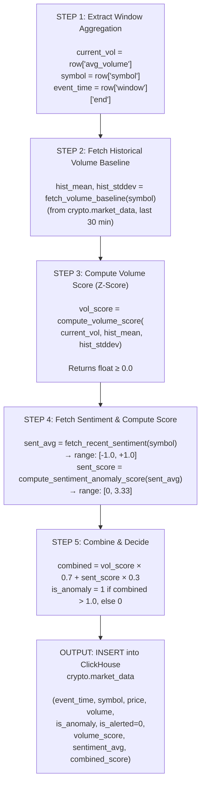
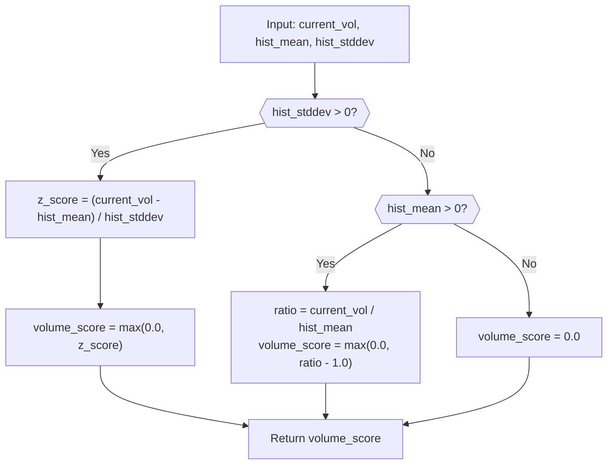
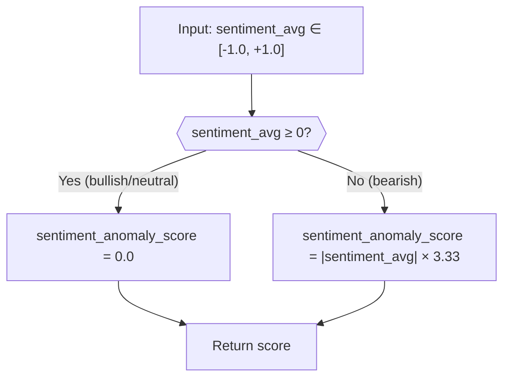
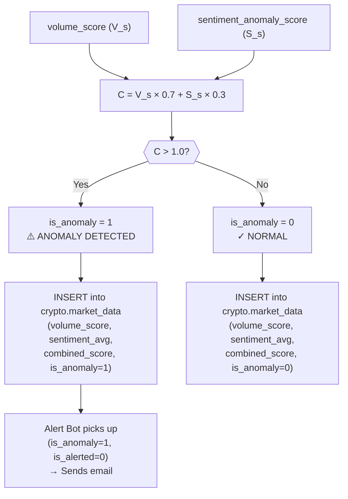
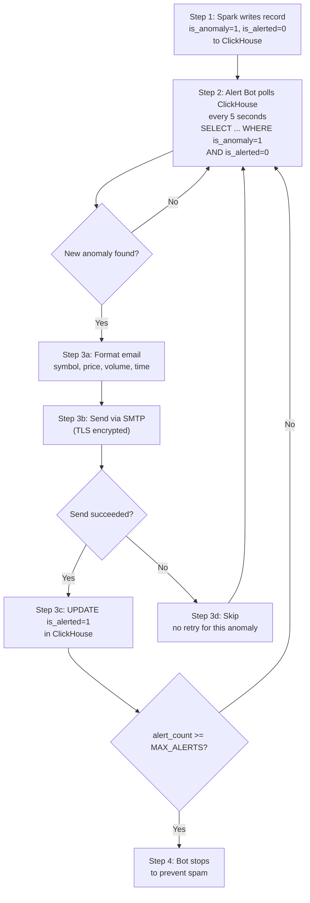
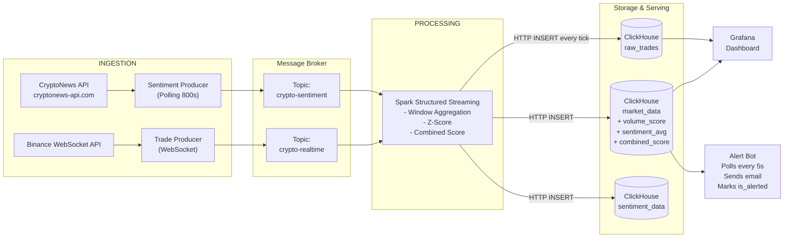

# Business Logic Document

## Crypto Anomaly Detection Pipeline — Complete Business & Technical Logic

---

## 1. Business Objective

This system continuously monitors the cryptocurrency market to **detect abnormal trading activity in real time** and **immediately notify stakeholders via email**. The goal is to protect investors and analysts from events such as:

- **Flash crashes** — sudden, severe price drops (e.g., Bitcoin losing 30% in hours).
- **Pump-and-dump schemes** — artificial inflation followed by a sell-off, often orchestrated by whales (large holders).
- **Whale movements** — abnormally large trades that can shift the market.
- **News-driven volatility** — sudden reactions to regulatory announcements, exchange hacks, or macroeconomic events.

### Who Benefits?

| Stakeholder | Value |
|---|---|
| **Retail Investors** | Early warning to exit positions before crash deepens |
| **Algorithmic Traders** | Signal to trigger automated buy/sell orders |
| **Exchange Compliance** | Detection of wash trading or spoofing activity |
| **Risk Managers** | Real-time portfolio risk recalculation |

---

## 2. Data Sources

The system ingests data from two independent sources:

### 2.1. Binance WebSocket API (Trade Data)

- **What:** Real-time trade events for 6 cryptocurrency pairs.
- **How:** Persistent WebSocket connection (push-based, not polling).
- **Frequency:** Millisecond-level; each individual trade generates an event.
- **Kafka Topic:** `crypto-realtime`

| Trading Pair | Symbol | Asset |
|---|---|---|
| BTC/USDT | BTCUSDT | Bitcoin |
| ETH/USDT | ETHUSDT | Ethereum |
| SOL/USDT | SOLUSDT | Solana |
| DOGE/USDT | DOGEUSDT | Dogecoin |
| BNB/USDT | BNBUSDT | Binance Coin |
| XRP/USDT | XRPUSDT | Ripple |

**Fields per trade event:**

| Field | Type | Description |
|---|---|---|
| `timestamp` | Long (ms) | Exact time the trade occurred on Binance |
| `symbol` | String | Trading pair identifier |
| `price` | Float | Execution price in USDT |
| `volume` | Float | Trade quantity |

### 2.2. CryptoNews API (Sentiment Data)

- **What:** Aggregated crypto news articles with AI-powered sentiment classification.
- **How:** REST API polling every 800 seconds.
- **Source:** cryptonews-api.com — a news aggregator that indexes articles from 50+ trusted crypto media outlets (Coindesk, Cointelegraph, Decrypt, Bloomberg, etc.).
- **API Docs:** https://cryptonews-api.com/documentation
- **Kafka Topic:** `crypto-sentiment`

**Fields per sentiment record:**

| Field | Type | Description |
|---|---|---|
| `timestamp` | Long (ms) | Time the record was fetched |
| `symbol` | String | Mapped to trading pair (e.g., `BTCUSDT`) |
| `sentiment_score` | Float [-1, 1] | Computed from API sentiment + source trust + ticker relevance |
| `sentiment_label` | String | `bullish`, `bearish`, or `neutral` |
| `title` | String | News headline |
| `votes_positive` | Int | 1 if API sentiment is Positive, else 0 |
| `votes_negative` | Int | 1 if API sentiment is Negative, else 0 |
| `votes_important` | Int | Reserved (always 0) |

**How `sentiment_score` is computed:**

```
base_score = +0.6 (Positive), -0.6 (Negative), 0.0 (Neutral)  ← from API sentiment field

If article is from a trusted source (Coindesk, Bloomberg, Reuters, etc.):
    base_score += ±0.2  (source trust boost)

If article mentions only 1 ticker (more targeted signal):
    base_score += ±0.1  (ticker relevance boost)

Final score is clamped to [-1.0, +1.0]
```

**Sentiment classification:**

| Score Range | Label |
|---|---|
| `> +0.3` | Bullish |
| `-0.3` to `+0.3` | Neutral |
| `< -0.3` | Bearish |

---

## 3. Processing Pipeline

### 3.1. Windowed Aggregation (Spark Structured Streaming)

Raw trade events arrive at millisecond frequency — far too granular for anomaly detection. Spark aggregates them into **sliding time windows**.

| Parameter | Value | Rationale |
|---|---|---|
| **Window Size** | 1 minute | Captures enough trades for meaningful statistics |
| **Slide Interval** | 30 seconds | Overlapping windows ensure anomalies at boundaries are caught |
| **Watermark** | 1 minute | Tolerates late-arriving data before discarding |

**For each window per symbol, Spark computes:**

| Metric | Formula | Purpose |
|---|---|---|
| `avg_price` | `mean(price)` | Average trade price in the window |
| `avg_volume` | `mean(volume)` | Average trade volume in the current window |

### 3.2. Combined Anomaly Scoring

The system uses a **multi-signal anomaly detection model** that combines two independent indicators:

$$
\text{combined\_score} = \text{volume\_score} \times 0.7 + \text{sentiment\_anomaly\_score} \times 0.3
$$

#### Step-by-Step Processing Per Batch

Every 30 seconds (the slide interval), Spark emits an aggregated row per symbol. The `write_trades_to_clickhouse` function processes each row through these 4 steps:



---

#### Signal 1: Volume Score (Weight: 70%)

This measures how unusual the current window's average volume is compared to the **historical baseline** (mean and stddev from the last 30 minutes of stored windows in ClickHouse), using the **Z-Score (3-Sigma Rule)**.

**Historical baseline lookup** (from `fetch_volume_baseline` in `spark_processor_sentiment_docker.py`):

```python
def fetch_volume_baseline(symbol):
    # Queries ClickHouse for historical mean and stddev
    query = """
        SELECT avg(volume) AS hist_mean,
               stddevPop(volume) AS hist_stddev,
               count() AS cnt
        FROM crypto.market_data
        WHERE symbol = '{symbol}'
          AND event_time >= now() - INTERVAL 30 MINUTE
    """
    # Returns (hist_mean, hist_stddev) or (0.0, 0.0) if < 3 data points
```

**Volume score computation** (from `compute_volume_score`):

```python
def compute_volume_score(current_vol, hist_mean, hist_stddev):
    if hist_stddev and hist_stddev > 0:
        z_score = (current_vol - hist_mean) / hist_stddev
        return max(0.0, z_score)     # Only positive deviations matter
    else:
        # Not enough historical data — use simple ratio
        if hist_mean > 0:
            ratio = current_vol / hist_mean
            return max(0.0, ratio - 1.0)
        return 0.0
```

**Formulas:**

Normal case (sufficient historical data, $\sigma_{hist} > 0$):

$$
\text{volume\_score} = \max\left(0,\ \frac{V_{current} - \mu_{hist}}{\sigma_{hist}}\right)
$$

Where:
- $V_{current}$ = current window's average volume (`avg_volume`)
- $\mu_{hist}$ = historical mean volume from last 30 min of `market_data`
- $\sigma_{hist}$ = historical standard deviation from last 30 min of `market_data`

Cold start fallback ($\sigma_{hist} = 0$ or fewer than 3 historical records):

$$
\text{volume\_score} = \max\left(0,\ \frac{V_{current}}{\mu_{hist}} - 1\right)
$$

**Decision logic as flowchart:**



**Interpretation:**

| Volume Score | Meaning | Statistical Context |
|---|---|---|
| 0.0 | Normal | Volume is at or below the mean |
| 1.0 | Slightly elevated | 1 standard deviation above mean ($\approx$ 68th percentile) |
| 2.0 | Elevated | 2 standard deviations ($\approx$ 95th percentile) |
| 3.0+ | Extreme spike | 3+ standard deviations ($\approx$ 99.7th percentile) |

**Why Z-Score?** In a normal distribution, 99.7% of data falls within 3 standard deviations. A volume score above 3.0 means the current activity is statistically extremely rare — occurring less than 0.3% of the time under normal conditions.

**Important:** Only positive deviations are considered. If volume drops below the mean, the score is clamped to 0.0 — we only detect **spikes**, not dips.

---

#### Signal 2: Sentiment Anomaly Score (Weight: 30%)

This captures the "mood" of the crypto news cycle. Negative sentiment amplifies the anomaly signal; positive/neutral sentiment contributes nothing.

**How sentiment is fetched** (from `fetch_recent_sentiment`):

```sql
SELECT avg(sentiment_score) AS avg_score, count() AS cnt
FROM crypto.sentiment_data
WHERE symbol = '{symbol}'
  AND event_time >= now() - INTERVAL 60 MINUTE
```

The function looks back **60 minutes** (configurable via `SENTIMENT_LOOKBACK_MINUTES`) and averages all sentiment scores for that symbol. This smooths out individual article noise and captures the overall news direction.

**Sentiment averaging formula:**

$$
\text{sent\_avg} = \frac{1}{N} \sum_{i=1}^{N} s_i \quad \text{where } s_i \in [-1.0,\ +1.0]
$$

Where $N$ = number of articles for the symbol in the last 60 minutes, and $s_i$ = individual article sentiment score.

**Conversion to anomaly score** (from `compute_sentiment_anomaly_score`):

```python
def compute_sentiment_anomaly_score(sentiment_avg):
    if sentiment_avg >= 0:
        return 0.0                      # Bullish/neutral → no anomaly
    return abs(sentiment_avg) * 3.33    # Bearish → linear scale to ~3.33
```

**Formula:**

$$
\text{sentiment\_anomaly\_score} =
\begin{cases}
0 & \text{if } \text{sent\_avg} \geq 0 \\
|\text{sent\_avg}| \times 3.33 & \text{if } \text{sent\_avg} < 0
\end{cases}
$$

**Decision logic as flowchart:**



**Interpretation:**

| Sentiment Avg | Anomaly Score | Meaning |
|---|---|---|
| +1.0 (very bullish) | 0.0 | No anomaly contribution |
| +0.5 (bullish) | 0.0 | No anomaly contribution |
| 0.0 (neutral) | 0.0 | No anomaly contribution |
| -0.3 (mildly bearish) | 1.0 | Moderate concern |
| -0.6 (bearish) | 2.0 | Significant concern |
| -1.0 (very bearish) | 3.33 | Maximum concern |

**Design rationale:** The multiplier $3.33 = \frac{10}{3}$ is chosen so that at maximum bearish sentiment ($-1.0$), the sentiment anomaly score ($3.33$) is comparable in magnitude to a 3-sigma volume spike ($3.0$). This ensures sentiment can meaningfully contribute to the combined score when weighted at 30%.

**Edge case — No sentiment data:** If no articles exist for a symbol in the last 60 minutes, `fetch_recent_sentiment` returns `0.0`, making the sentiment score `0.0`. The system falls back to volume-only detection.

---

#### Combined Score & Decision

**Final formula:**

$$
C = V_s \times W_v + S_s \times W_s
$$

Where:
- $C$ = `combined_score`
- $V_s$ = `volume_score` (Z-score, $\geq 0$)
- $S_s$ = `sentiment_anomaly_score` ($\in [0, 3.33]$)
- $W_v = 0.7$ (volume weight)
- $W_s = 0.3$ (sentiment weight)

**Decision rule:**

$$
\text{is\_anomaly} =
\begin{cases}
1 & \text{if } C > 1.0 \\
0 & \text{otherwise}
\end{cases}
$$

**Full decision flowchart:**



**Threshold analysis ($C_{threshold} = 1.0$):**

Solving for minimum required scores:

- Volume only: $V_s \times 0.7 > 1.0 \Rightarrow V_s > 1.43$ (i.e., $\approx 1.4\sigma$)
- Sentiment only: $S_s \times 0.3 > 1.0 \Rightarrow S_s > 3.33$ (impossible, max is 3.33)
- Equal contribution: $V_s = 0.72,\ S_s = 1.93$ (sent_avg $\approx -0.58$)

| Scenario | Minimum vol_score needed | Minimum sent_score needed |
|---|---|---|
| Volume only (no bad news) | 1.43 (~1.4σ) | N/A (sent = 0) |
| Sentiment only (normal volume) | N/A (vol = 0) | 3.34 (impossible alone since max is 3.33) |
| Both contribute equally | 0.72 (~0.7σ) | 1.93 (sent_avg ≈ -0.58) |

**Key insight:** Pure sentiment alone can almost but never quite trigger an anomaly (max = $0.3 \times 3.33 = 0.999$). This is intentional — the system requires **at least some** volume signal to confirm.

---

### 3.3. Worked Numerical Example

**Scenario: BTC flash crash with panic selling and bad news**

```
Given (from Spark window aggregation):
  symbol        = "BTCUSDT"
  current_vol   = 15.8 BTC
  mean_vol      = 3.2 BTC
  stddev_vol    = 2.5 BTC
  avg_price     = 64,250 USDT

Given (from ClickHouse sentiment_data, last 60 min):
  3 articles found for BTCUSDT:
    Article 1: sentiment_score = -0.6  (bearish, trusted source)
    Article 2: sentiment_score = -0.8  (bearish, single ticker)
    Article 3: sentiment_score = +0.1  (neutral)
  sentiment_avg = (-0.6 + -0.8 + 0.1) / 3 = -0.433
```

**Step-by-step calculation:**

```
Step 2: Volume Score
  vol_score = max(0, (15.8 - 3.2) / 2.5)
            = max(0, 12.6 / 2.5)
            = max(0, 5.04)
            = 5.04                        ← Extreme spike (>3σ)

Step 3: Sentiment Score
  sentiment_avg = -0.433 (negative, so calculate score)
  sent_score = |-0.433| × 3.33
             = 0.433 × 3.33
             = 1.442                      ← Significant concern

Step 4: Combined Score
  combined = 5.04 × 0.7 + 1.442 × 0.3
           = 3.528 + 0.433
           = 3.961                        ← Far above threshold

Decision:
  3.961 > 1.0  →  is_anomaly = 1         ← ANOMALY!
```

**What gets written to ClickHouse `market_data`:**

| Column | Value |
|---|---|
| `event_time` | 2024-01-15 14:30:00 |
| `symbol` | BTCUSDT |
| `price` | 64250.0 |
| `volume` | 15.8 |
| `is_anomaly` | 1 |
| `is_alerted` | 0 |
| `volume_score` | 5.04 |
| `sentiment_avg` | -0.433 |
| `combined_score` | 3.961 |

The Alert Bot will then pick this up (since `is_anomaly=1` and `is_alerted=0`) and send an email.

---

### 3.4. Real-World Detection Scenarios

| # | Scenario | vol_score | sent_score | combined | Result |
|---|---|---|---|---|---|
| 1 | Normal trading, no news | 0.5 | 0.0 | 0.35 | NORMAL |
| 2 | Slight volume bump, neutral news | 1.2 | 0.0 | 0.84 | NORMAL |
| 3 | **Volume spike (3σ)**, neutral news | 3.0 | 0.0 | **2.10** | **ANOMALY** |
| 4 | **Volume spike (3σ)**, bullish news | 3.0 | 0.0 | **2.10** | **ANOMALY** |
| 5 | Moderate volume (2σ), **bearish news** (-0.6) | 2.0 | 2.0 | **2.00** | **ANOMALY** |
| 6 | Normal volume, **very bearish news** (-1.0) | 0.5 | 3.33 | **1.35** | **ANOMALY** |
| 7 | Slightly elevated volume, mildly bearish news | 1.0 | 1.0 | **1.00** | NORMAL (boundary) |
| 8 | No volume data (cold start), very bearish news | 0.0 | 3.33 | **1.00** | NORMAL (boundary) |

**Key insights:**
- Scenarios 5 and 6 would **NOT** be detected by a volume-only (3-sigma) system. The sentiment integration catches these previously invisible anomalies.
- Scenario 4 shows that **good news does NOT suppress** a volume spike — bullish sentiment maps to 0, not a negative score.
- Scenario 8 shows the system is **conservative on cold start** — even maximum bearish sentiment alone cannot trigger (0.999 < 1.0).

---

### 3.5. Edge Cases & Failure Modes

| Condition | Behavior | Rationale |
|---|---|---|
| `hist_stddev = 0` or < 3 historical records | Falls back to ratio: `(vol/mean) - 1` | Cold start; not enough historical data yet |
| `hist_mean = 0` | Returns `vol_score = 0.0` | Avoid division by zero; no baseline |
| ClickHouse unreachable for volume baseline | `hist_mean = 0.0`, `hist_stddev = 0.0` | Graceful degradation; vol_score = 0 |
| No sentiment data in ClickHouse | `sentiment_avg = 0.0`, `sent_score = 0.0` | Defaults to volume-only mode |
| ClickHouse unreachable for sentiment query | `sentiment_avg = 0.0` (exception caught) | Graceful degradation; logs warning |
| Negative volume score (vol < mean) | Clamped to `0.0` by `max(0, ...)` | Only spikes are anomalies, not dips |
| All news is positive | `sent_score = 0.0` always | Bullish news does not reduce anomaly risk |
| Extremely high volume score (e.g., 50.0) | No cap; combined score can be very high | Magnitude indicates severity in Grafana |

### 3.6. Configurable Parameters

All scoring parameters are defined as constants in the Spark processor and can be tuned:

| Parameter | Default | Location | Effect |
|---|---|---|---|
| `VOLUME_WEIGHT` | 0.7 | `spark_processor_sentiment_docker.py` line 54 | How much volume contributes to final score |
| `SENTIMENT_WEIGHT` | 0.3 | `spark_processor_sentiment_docker.py` line 55 | How much sentiment contributes to final score |
| `COMBINED_THRESHOLD` | 1.0 | `spark_processor_sentiment_docker.py` line 56 | Score above this = anomaly |
| `SENTIMENT_LOOKBACK_MINUTES` | 60 | `spark_processor_sentiment_docker.py` line 57 | How far back to average sentiment data |
| `VOLUME_LOOKBACK_MINUTES` | 30 | `spark_processor_sentiment_docker.py` line 58 | How far back to compute volume baseline |
| Window Size | 1 minute | Spark aggregation | Time window for volume statistics |
| Slide Interval | 30 seconds | Spark aggregation | How often windows are recalculated |

**Tuning guidelines:**
- **Lower `COMBINED_THRESHOLD`** (e.g., 0.5) → more sensitive, more false positives
- **Raise `COMBINED_THRESHOLD`** (e.g., 2.0) → fewer alerts, might miss subtle anomalies
- **Increase `SENTIMENT_WEIGHT`** → sentiment has more influence; good if news correlates well with price moves
- **Decrease `SENTIMENT_LOOKBACK_MINUTES`** (e.g., 10) → react faster to breaking news, but noisier
- **Increase `SENTIMENT_LOOKBACK_MINUTES`** (e.g., 120) → smoother signal, slower reaction

---

## 4. Storage Schema

All processed data is stored in ClickHouse, an OLAP database optimized for time-series analytics.

### 4.1. `crypto.market_data` — Trade Anomaly Records

| Column | Type | Description |
|---|---|---|
| `event_time` | DateTime | End timestamp of the aggregation window |
| `symbol` | String | Trading pair (e.g., BTCUSDT) |
| `price` | Float64 | Average price during the window |
| `volume` | Float64 | Average volume during the window |
| `is_anomaly` | UInt8 | `1` = anomaly detected, `0` = normal |
| `is_alerted` | UInt8 | `1` = email alert sent, `0` = not yet alerted |
| `volume_score` | Float64 | Volume Z-score (0 = normal, 3+ = extreme) |
| `sentiment_avg` | Float64 | Average sentiment in lookback window [-1, 1] |
| `combined_score` | Float64 | Final weighted anomaly score |

**Engine:** `ReplacingMergeTree()` — deduplicates rows with the same primary key on merge.
**Partitioned by:** Month (`toYYYYMM(event_time)`) — efficient pruning for time-range queries.
**Ordered by:** `(symbol, event_time)` — optimized for per-symbol time-series queries.

### 4.2. `crypto.sentiment_data` — Raw Sentiment Records

| Column | Type | Description |
|---|---|---|
| `event_time` | DateTime | When the sentiment was fetched |
| `symbol` | String | Trading pair (e.g., BTCUSDT) |
| `source` | String | Data source (`cryptonews-api` or `cryptonews_mock`) |
| `post_id` | String | Unique identifier of the news post |
| `title` | String | News headline |
| `kind` | String | Post type: `news`, `media`, `analysis`, `opinion` |
| `sentiment_score` | Float64 | Numeric sentiment [-1.0, +1.0] |
| `sentiment_label` | String | `bullish`, `bearish`, or `neutral` |
| `votes_positive` | UInt32 | 1 if API sentiment is Positive, else 0 |
| `votes_negative` | UInt32 | 1 if API sentiment is Negative, else 0 |
| `votes_important` | UInt32 | Reserved (always 0) |
| `url` | String | Link to the original article |
| `published_at` | String | Original publication timestamp |

**Ordered by:** `(symbol, event_time, post_id)` — prevents duplicate posts per symbol.

### 4.3. `crypto.raw_trades` — Tick-by-Tick Price History

| Column | Type | Description |
|---|---|---|
| `event_time` | DateTime64(3) | Trade timestamp with millisecond precision |
| `symbol` | String | Trading pair (e.g., BTCUSDT) |
| `price` | Float64 | Exact trade price in USDT |
| `volume` | Float64 | Trade quantity |

**Engine:** `MergeTree()` — no deduplication, every tick is stored.
**Partitioned by:** Month (`toYYYYMM(event_time)`).
**Ordered by:** `(symbol, event_time)` — optimized for time-series price charts.

This table stores every individual trade from Binance for high-resolution price visualization in Grafana (candlestick charts, tick-by-tick price lines).

---

## 5. Alert System

### 5.1. How Alerts Are Triggered

The Alert Bot is a standalone Python service that continuously monitors ClickHouse for new anomalies.

**Lifecycle of an alert:**



### 5.2. Anti-Spam & Deduplication

The system has **three layers** of protection against duplicate or excessive alerts:

| Layer | Mechanism | Where |
|---|---|---|
| **Database flag** | `is_alerted` column — once set to `1`, the anomaly is never queried again | ClickHouse |
| **In-memory set** | `alerted_anomalies` set tracks `{symbol}_{event_time}` keys within the current session | Alert Bot (Python) |
| **Hard limit** | `MAX_ALERTS` — bot terminates after sending this many emails (default: 1) | Alert Bot config |

### 5.3. Alert Email Content

```
Subject: Anomaly Detected: ETHUSDT

Body:
Anomaly Detected in Crypto Market

Pair: ETHUSDT
Price: $3,110.00
Volume: 999,999.99
Time: 2026-01-13 11:30:00

Check your dashboard for more details.

Alert 1 of 1
```

### 5.4. Alert Configuration

| Parameter | Default | Description |
|---|---|---|
| `CHECK_INTERVAL` | 5 seconds | How often the bot polls ClickHouse |
| `MAX_ALERTS` | 1 | Maximum emails before the bot stops |
| `SMTP_SERVER` | `smtp.mailersend.net` | Email provider SMTP host |
| `SMTP_PORT` | 2525 | SMTP port (TLS) |
| `SENDER_EMAIL` | Configured in docker-compose | "From" address |
| `RECEIVER_EMAIL` | Configured in docker-compose | "To" address |

### 5.5. Supported Email Providers

| Provider | SMTP Server | Port |
|---|---|---|
| MailerSend | `smtp.mailersend.net` | 587 / 2525 |
| Gmail | `smtp.gmail.com` | 587 |
| SMTP2GO | `mail.smtp2go.com` | 2525 |
| SendGrid | `smtp.sendgrid.net` | 587 |

---

## 6. Visualization (Grafana)

Grafana connects directly to ClickHouse and provides real-time dashboards.

### Recommended Dashboard Panels

**Panel 1: Tick-by-Tick Price Chart**
```sql
SELECT event_time AS time, symbol, price
FROM crypto.raw_trades
WHERE $__timeFilter(event_time) ORDER BY time;
```

**Panel 2: OHLC Candlestick (1-Minute Candles)**
```sql
SELECT
    toStartOfMinute(event_time) AS time, symbol,
    argMin(price, event_time) AS open,
    max(price) AS high, min(price) AS low,
    argMax(price, event_time) AS close,
    sum(volume) AS total_volume
FROM crypto.raw_trades
WHERE $__timeFilter(event_time) AND symbol = 'BTCUSDT'
GROUP BY time, symbol ORDER BY time;
```

**Panel 3: Combined Anomaly Score Over Time**
```sql
SELECT event_time AS time, combined_score, volume_score, sentiment_avg
FROM crypto.market_data
WHERE symbol = 'BTCUSDT'
ORDER BY time;
```

**Panel 4: Sentiment Timeline**
```sql
SELECT event_time AS time, sentiment_score, sentiment_label, title
FROM crypto.sentiment_data
WHERE symbol = 'BTCUSDT'
ORDER BY time DESC LIMIT 50;
```

**Panel 5: Anomaly Summary Table**
```sql
SELECT event_time, symbol, price, volume,
       volume_score, sentiment_avg, combined_score
FROM crypto.market_data
WHERE is_anomaly = 1
ORDER BY event_time DESC LIMIT 20;
```

---

## 7. End-to-End Timing

| Stage | Latency | Description |
|---|---|---|
| Binance → Kafka | < 500ms | WebSocket push + Kafka write |
| Kafka → Spark | ~1-3s | Micro-batch interval |
| Spark → ClickHouse | < 500ms | HTTP insert per record |
| ClickHouse → Alert Bot | 0-5s | Polling interval |
| Alert Bot → Email | ~1-2s | SMTP send |
| **Total end-to-end** | **~2-8 seconds** | From trade event to email in inbox |

---

## 8. System Limitations & Known Trade-offs

### Cold Start Problem
When the system first starts, the historical volume baseline in ClickHouse has fewer than 3 data points (or `hist_stddev = 0`). During this period:
- Volume score falls back to a simple ratio: `(current / hist_mean) - 1`, or returns 0 if no baseline exists
- Sentiment data may also be empty if the sentiment producer just started
- Anomaly detection accuracy improves after ~2-3 minutes of data accumulation (once enough windows are stored in `market_data`)

### Sentiment Latency Gap
- Trade data arrives in **milliseconds**
- Sentiment data updates every **800 seconds**
- This means sentiment reflects the news cycle, not instantaneous market reaction
- The 60-minute lookback window smooths this gap

### ClickHouse UPDATE Cost
- `ALTER TABLE UPDATE` (used for `is_alerted = 1`) is an expensive mutation in ClickHouse
- Acceptable for low-frequency alert updates (max 1 per run)
- Not suitable if alert volume were to increase significantly

### Single Kafka Partition
- Current setup uses 1 partition for simplicity
- Ensures strict ordering within the topic
- Limits horizontal scaling of consumers — would need repartitioning for production

---

## 9. Architecture Summary



---

## 10. Glossary

| Term | Definition |
|---|---|
| **3-Sigma Rule** | Statistical rule: 99.7% of normally distributed data falls within 3 standard deviations of the mean |
| **Z-Score** | Number of standard deviations a data point is from the mean |
| **Whale** | A large cryptocurrency holder whose trades can significantly move the market |
| **Pump-and-dump** | Artificially inflating an asset's price, then selling at the peak |
| **Flash crash** | Rapid, deep price decline followed by a quick recovery |
| **Sliding window** | A time window that overlaps with the next; captures events at boundaries |
| **Watermark** | Maximum allowed delay for late-arriving data before it is discarded |
| **OLAP** | Online Analytical Processing — optimized for aggregation queries over large datasets |
| **Micro-batch** | Small batch of streaming data processed at regular intervals (Spark model) |
| **Kappa Architecture** | Architecture that processes all data as streams (no separate batch layer) |
| **Bearish** | Market sentiment expecting prices to fall |
| **Bullish** | Market sentiment expecting prices to rise |
| **USDT** | Tether — a stablecoin pegged to the US Dollar, used as the quote currency |
