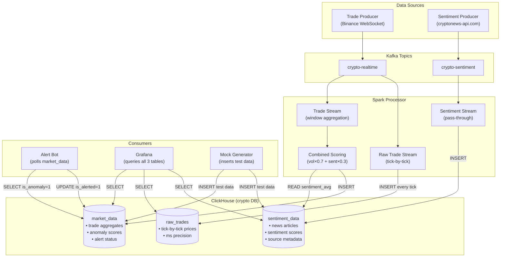

# ClickHouse Database Documentation

## Crypto Anomaly Detection Pipeline — Database Schema, Queries & Operations

---

## 1. Overview

| Property | Value |
|----------|-------|
| **Database Engine** | ClickHouse (column-oriented OLAP) |
| **Database Name** | `crypto` |
| **Tables** | 3 (`market_data`, `raw_trades`, `sentiment_data`) |
| **Table Engine** | `ReplacingMergeTree()` / `MergeTree()` |
| **Docker Image** | `clickhouse/clickhouse-server:latest` |
| **Ports** | `8123` (HTTP), `9000` (Native TCP) |
| **User** | `default` (no password) |
| **Connection (Docker)** | `clickhouse:8123` (HTTP) / `clickhouse:9000` (Native) |
| **Connection (Host)** | `localhost:8123` (HTTP) / `localhost:9000` (Native) |

### Why ClickHouse?

- Optimized for **time-series analytics** — fast aggregation over millions of rows
- **Column-oriented storage** — efficient for queries that read a few columns from many rows
- **Monthly partitioning** — automatic pruning on time-range queries
- **ReplacingMergeTree** — built-in deduplication on merge by primary key
- **Low-latency inserts** — handles the real-time write load from Spark

---

## 2. Schema Initialization

The schema is defined in `src/clickhouse_init.sql` and must be run after starting services:

```bash
# Linux / macOS
docker exec -i crypto-bigdata-project-clickhouse-1 clickhouse-client < src/clickhouse_init.sql

# Windows PowerShell (< not supported)
Get-Content src/clickhouse_init.sql | docker exec -i crypto-bigdata-project-clickhouse-1 clickhouse-client --multiquery
```

### Full DDL

```sql
CREATE DATABASE IF NOT EXISTS crypto;

USE crypto;

CREATE TABLE IF NOT EXISTS market_data (
    event_time DateTime,
    symbol String,
    price Float64,
    volume Float64,
    is_anomaly UInt8,
    is_alerted UInt8 DEFAULT 0,
    volume_score Float64 DEFAULT 0,
    sentiment_avg Float64 DEFAULT 0,
    combined_score Float64 DEFAULT 0
) ENGINE = ReplacingMergeTree()
PARTITION BY toYYYYMM(event_time)
ORDER BY (symbol, event_time);

CREATE TABLE IF NOT EXISTS sentiment_data (
    event_time DateTime,
    symbol String,
    source String,
    post_id String,
    title String,
    kind String,
    sentiment_score Float64,
    sentiment_label String,
    votes_positive UInt32,
    votes_negative UInt32,
    votes_important UInt32,
    url String,
    published_at String
) ENGINE = ReplacingMergeTree()
PARTITION BY toYYYYMM(event_time)
ORDER BY (symbol, event_time, post_id);

CREATE TABLE IF NOT EXISTS raw_trades (
    event_time DateTime64(3),
    symbol String,
    price Float64,
    volume Float64
) ENGINE = MergeTree()
PARTITION BY toYYYYMM(event_time)
ORDER BY (symbol, event_time);
```

---

## 3. Table: `crypto.market_data`

Stores aggregated trade data with anomaly scoring results. Each row represents the output of one Spark sliding window (1-minute window, 30-second slide) for one trading pair.

### 3.1. Column Reference

| Column | Type | Default | Written By | Description |
|--------|------|---------|------------|-------------|
| `event_time` | DateTime | — | Spark | End timestamp of the aggregation window |
| `symbol` | String | — | Spark | Trading pair (e.g., `BTCUSDT`, `ETHUSDT`) |
| `price` | Float64 | — | Spark | Average price during the window |
| `volume` | Float64 | — | Spark | Average volume during the window |
| `is_anomaly` | UInt8 | — | Spark | `1` = anomaly detected, `0` = normal |
| `is_alerted` | UInt8 | `0` | Alert Bot | `1` = email alert sent, `0` = not yet alerted |
| `volume_score` | Float64 | `0` | Spark | Volume Z-score vs historical baseline (0 = normal, 3+ = extreme spike) |
| `sentiment_avg` | Float64 | `0` | Spark | Average sentiment from last 60 minutes [-1.0, +1.0] |
| `combined_score` | Float64 | `0` | Spark | Final weighted anomaly score |

### 3.2. Engine & Keys

| Property | Value | Rationale |
|----------|-------|-----------|
| **Engine** | `ReplacingMergeTree()` | Deduplicates rows with identical primary key on background merge |
| **Partition Key** | `toYYYYMM(event_time)` | Monthly partitions — efficient pruning for time-range queries |
| **Order Key (Primary)** | `(symbol, event_time)` | Optimized for per-symbol time-series lookups |

### 3.3. How Data Gets Written

**Writer: Spark Processor** (`spark_processor_sentiment_docker.py`)

```
Trade Kafka messages → Spark sliding window aggregation → HTTP INSERT to ClickHouse
```

Each micro-batch computes:
1. `avg_price`, `avg_volume` from the current window
2. Fetches historical volume baseline (mean, stddev) from `market_data` (last 30 min)
3. `volume_score` = Z-score of current avg_volume vs historical baseline
4. `sentiment_avg` = fetched from `sentiment_data` (last 60 min average)
5. `combined_score` = `volume_score × 0.7 + sentiment_anomaly_score × 0.3`
6. `is_anomaly` = `1` if `combined_score > 1.0`

**Writer: Alert Bot** (`alert_bot.py`)

Updates `is_alerted` from `0` → `1` after successfully sending an email:

```sql
ALTER TABLE crypto.market_data
UPDATE is_alerted = 1
WHERE event_time = '{event_time}' AND symbol = '{symbol}' AND is_anomaly = 1
```

**Writer: Mock Generator** (`mock_anomaly.py`)

Inserts predefined test scenarios directly via `clickhouse-connect`:

```sql
INSERT INTO crypto.market_data
(event_time, symbol, price, volume, is_anomaly, is_alerted,
 volume_score, sentiment_avg, combined_score)
VALUES (...)
```

### 3.4. Scoring Column Details

#### `volume_score` (Z-Score)

| Value | Meaning | Statistical Context |
|-------|---------|---------------------|
| 0.0 | Normal | Volume at or below the mean |
| 1.0 | Slightly elevated | 1σ above mean (~84th percentile) |
| 2.0 | Elevated | 2σ above mean (~95th percentile) |
| 3.0+ | Extreme spike | 3σ+ above mean (~99.7th percentile) |

#### `sentiment_avg`

| Value | Label | Source |
|-------|-------|--------|
| +0.6 to +1.0 | Bullish | Positive news from cryptonews-api.com |
| -0.3 to +0.3 | Neutral | Mixed/no significant news |
| -1.0 to -0.3 | Bearish | Negative news (regulatory, hacks, etc.) |

#### `combined_score`

```
combined_score = volume_score × 0.7 + sentiment_anomaly_score × 0.3

where sentiment_anomaly_score = |sentiment_avg| × 3.33  (only if bearish, else 0)
```

| combined_score | Result |
|----------------|--------|
| ≤ 1.0 | NORMAL — no alert |
| > 1.0 | **ANOMALY** — triggers email alert |

---

## 4. Table: `crypto.sentiment_data`

Stores raw sentiment records fetched from cryptonews-api.com. Each row represents one news article with its sentiment classification.

### 4.1. Column Reference

| Column | Type | Default | Written By | Description |
|--------|------|---------|------------|-------------|
| `event_time` | DateTime | — | Spark | When the sentiment record was ingested |
| `symbol` | String | — | Spark | Trading pair (e.g., `BTCUSDT`) |
| `source` | String | — | Spark | `cryptonews-api` (live) or `cryptonews_mock` (test) |
| `post_id` | String | — | Spark | Unique news article ID from the API |
| `title` | String | — | Spark | News headline (max 500 chars) |
| `kind` | String | — | Spark | Article type: `news`, `article`, etc. |
| `sentiment_score` | Float64 | — | Spark | Custom score [-1.0, +1.0] from API sentiment + trust + ticker relevance |
| `sentiment_label` | String | — | Spark | `bullish`, `bearish`, or `neutral` |
| `votes_positive` | UInt32 | — | Spark | 1 if API sentiment is Positive, else 0 |
| `votes_negative` | UInt32 | — | Spark | 1 if API sentiment is Negative, else 0 |
| `votes_important` | UInt32 | — | Spark | Reserved (always 0) |
| `url` | String | — | Spark | Link to the original article |
| `published_at` | String | — | Spark | Original publication timestamp from API |

### 4.2. Engine & Keys

| Property | Value | Rationale |
|----------|-------|-----------|
| **Engine** | `ReplacingMergeTree()` | Deduplicates rows with identical primary key on merge |
| **Partition Key** | `toYYYYMM(event_time)` | Monthly partitions |
| **Order Key (Primary)** | `(symbol, event_time, post_id)` | `post_id` ensures the same article is not stored twice per symbol |

### 4.3. How Data Gets Written

**Writer: Spark Processor** (`spark_processor_sentiment_docker.py`)

```
Sentiment Kafka messages → Spark parse → HTTP INSERT to ClickHouse
```

Each record from the `crypto-sentiment` Kafka topic is inserted as-is after timestamp conversion.

**Writer: Mock Generator** (`mock_anomaly.py`)

Inserts test sentiment records with `source = 'cryptonews_mock'`:

```sql
INSERT INTO crypto.sentiment_data
(event_time, symbol, source, post_id, title, kind,
 sentiment_score, sentiment_label, votes_positive, votes_negative,
 votes_important, url, published_at)
VALUES (...)
```

### 4.4. Sentiment Score Calculation

The `sentiment_score` is computed by the Sentiment Producer before being sent to Kafka:

```
base_score = +0.6 (Positive), -0.6 (Negative), 0.0 (Neutral)  ← from API

If source is trusted (Coindesk, Bloomberg, Reuters, Cointelegraph, etc.):
    base_score += ±0.2

If article mentions only 1 ticker (more targeted):
    base_score += ±0.1

Final score clamped to [-1.0, +1.0]
```

### 4.5. How Sentiment Is Used by Spark

The Spark processor reads from this table during trade processing:

```sql
SELECT avg(sentiment_score) AS avg_score, count() AS cnt
FROM crypto.sentiment_data
WHERE symbol = '{symbol}'
AND event_time >= now() - INTERVAL 60 MINUTE
FORMAT JSON
```

This query runs via HTTP (`clickhouse:8123`) for each unique symbol in a trade micro-batch.

---

## 5. Table: `crypto.raw_trades`

Stores **every individual trade tick** from Binance WebSocket. This table is designed for high-resolution time-series visualization of coin prices in Grafana.

### 5.1. Column Reference

| Column | Type | Written By | Description |
|--------|------|------------|-------------|
| `event_time` | DateTime64(3) | Spark | Trade timestamp with millisecond precision |
| `symbol` | String | Spark | Trading pair (e.g., `BTCUSDT`) |
| `price` | Float64 | Spark | Exact trade price in USDT |
| `volume` | Float64 | Spark | Trade quantity |

### 5.2. Engine & Keys

| Property | Value | Rationale |
|----------|-------|-----------|
| **Engine** | `MergeTree()` | No dedup — every tick is unique and must be kept |
| **Partition Key** | `toYYYYMM(event_time)` | Monthly partitions |
| **Order Key** | `(symbol, event_time)` | Optimized for per-symbol time-series queries |

### 5.3. How Data Gets Written

**Writer: Spark Processor** (`spark_processor_sentiment_docker.py`)

```
Trade Kafka messages → Spark raw stream → HTTP INSERT to ClickHouse
```

Every trade from the `crypto-realtime` Kafka topic is written as-is (no aggregation). This is a separate Spark stream running alongside the aggregated trade stream.

### 5.4. Data Volume

| Metric | Approximate Value |
|--------|-------------------|
| Rows per second | ~10–50 (depends on market activity) |
| Rows per hour | ~36,000–180,000 |
| Rows per day | ~860,000–4,300,000 |
| Row size | ~40 bytes |
| Daily storage | ~35–170 MB (uncompressed) |

### 5.5. Grafana Queries for Price Charts

**Real-time price (last 15 min, 1-second resolution):**

```sql
SELECT
    event_time AS time,
    symbol,
    price
FROM crypto.raw_trades
WHERE symbol = 'BTCUSDT'
  AND event_time >= now() - INTERVAL 15 MINUTE
ORDER BY event_time
```

**Multi-coin price overlay:**

```sql
SELECT
    event_time AS time,
    symbol,
    price
FROM crypto.raw_trades
WHERE event_time >= now() - INTERVAL 15 MINUTE
ORDER BY event_time
```

**OHLC candlestick (1-minute candles):**

```sql
SELECT
    toStartOfMinute(event_time) AS time,
    symbol,
    argMin(price, event_time) AS open,
    max(price) AS high,
    min(price) AS low,
    argMax(price, event_time) AS close,
    sum(volume) AS total_volume
FROM crypto.raw_trades
WHERE symbol = 'BTCUSDT'
  AND event_time >= now() - INTERVAL 1 HOUR
GROUP BY time, symbol
ORDER BY time
```

**Price with moving average:**

```sql
SELECT
    toStartOfMinute(event_time) AS time,
    symbol,
    avg(price) AS avg_price,
    avgIf(price, event_time >= now() - INTERVAL 5 MINUTE) AS ma_5m
FROM crypto.raw_trades
WHERE symbol = 'BTCUSDT'
  AND event_time >= now() - INTERVAL 30 MINUTE
GROUP BY time, symbol
ORDER BY time
```

---

## 6. Data Flow Diagram



---

## 7. Common Queries

### 7.1. Monitoring & Status

```sql
-- Count all records
SELECT count() FROM crypto.market_data;
SELECT count() FROM crypto.raw_trades;
SELECT count() FROM crypto.sentiment_data;

-- Records per symbol
SELECT symbol, count() AS cnt
FROM crypto.market_data
GROUP BY symbol
ORDER BY cnt DESC;

-- Recent data (last 10 records)
SELECT event_time, symbol, price, volume, is_anomaly,
       volume_score, sentiment_avg, combined_score
FROM crypto.market_data
ORDER BY event_time DESC
LIMIT 10;

-- Recent sentiment
SELECT event_time, symbol, sentiment_score, sentiment_label, source, title
FROM crypto.sentiment_data
ORDER BY event_time DESC
LIMIT 10;
```

### 7.2. Anomaly Analysis

```sql
-- All anomalies with full scoring breakdown
SELECT event_time, symbol, price, volume,
       volume_score, sentiment_avg, combined_score,
       is_alerted
FROM crypto.market_data
WHERE is_anomaly = 1
ORDER BY event_time DESC;

-- Anomaly count per symbol
SELECT symbol, count() AS anomaly_count
FROM crypto.market_data
WHERE is_anomaly = 1
GROUP BY symbol
ORDER BY anomaly_count DESC;

-- Unalerted anomalies (pending alerts)
SELECT event_time, symbol, price, combined_score
FROM crypto.market_data
WHERE is_anomaly = 1 AND is_alerted = 0
ORDER BY event_time ASC;

-- Anomalies in the last hour
SELECT event_time, symbol, price,
       volume_score, sentiment_avg, combined_score
FROM crypto.market_data
WHERE is_anomaly = 1
AND event_time >= now() - INTERVAL 1 HOUR
ORDER BY event_time DESC;

-- Highest combined scores ever recorded
SELECT event_time, symbol, price,
       volume_score, sentiment_avg, combined_score
FROM crypto.market_data
ORDER BY combined_score DESC
LIMIT 20;
```

### 7.3. Sentiment Analysis

```sql
-- Sentiment distribution (bullish/neutral/bearish)
SELECT sentiment_label, count() AS cnt
FROM crypto.sentiment_data
GROUP BY sentiment_label;

-- Average sentiment per symbol (last hour)
SELECT symbol,
       avg(sentiment_score) AS avg_sentiment,
       count() AS article_count
FROM crypto.sentiment_data
WHERE event_time >= now() - INTERVAL 1 HOUR
GROUP BY symbol
ORDER BY avg_sentiment ASC;

-- Most negative news articles
SELECT event_time, symbol, sentiment_score, sentiment_label, title
FROM crypto.sentiment_data
WHERE sentiment_score < -0.5
ORDER BY sentiment_score ASC
LIMIT 20;

-- Sentiment trend over time (5-minute buckets)
SELECT
    toStartOfFiveMinutes(event_time) AS time_bucket,
    symbol,
    avg(sentiment_score) AS avg_score,
    count() AS articles
FROM crypto.sentiment_data
WHERE event_time >= now() - INTERVAL 1 HOUR
GROUP BY time_bucket, symbol
ORDER BY time_bucket DESC;

-- News sources contributing data
SELECT source, count() AS articles
FROM crypto.sentiment_data
GROUP BY source
ORDER BY articles DESC;
```

### 7.4. Correlation Analysis

```sql
-- Compare volume spikes with sentiment at anomaly time
SELECT
    m.event_time,
    m.symbol,
    m.price,
    m.volume_score,
    m.sentiment_avg,
    m.combined_score,
    (SELECT count() FROM crypto.sentiment_data s
     WHERE s.symbol = m.symbol
     AND s.event_time >= m.event_time - INTERVAL 60 MINUTE
     AND s.event_time <= m.event_time) AS articles_in_window
FROM crypto.market_data m
WHERE m.is_anomaly = 1
ORDER BY m.event_time DESC;

-- Price movement during bearish sentiment periods
SELECT
    toStartOfFiveMinutes(event_time) AS time_bucket,
    symbol,
    avg(price) AS avg_price,
    avg(sentiment_avg) AS avg_sentiment,
    max(combined_score) AS max_score
FROM crypto.market_data
WHERE sentiment_avg < -0.3
GROUP BY time_bucket, symbol
ORDER BY time_bucket DESC
LIMIT 50;
```

---

## 8. Administrative Operations

### 8.1. Schema Modifications

```sql
-- Add a new column
ALTER TABLE crypto.market_data
ADD COLUMN IF NOT EXISTS new_column Float64 DEFAULT 0;

-- Check current schema
DESCRIBE crypto.market_data;
DESCRIBE crypto.raw_trades;
DESCRIBE crypto.sentiment_data;

-- Check table sizes
SELECT
    table,
    formatReadableSize(sum(bytes_on_disk)) AS disk_size,
    sum(rows) AS total_rows,
    count() AS parts
FROM system.parts
WHERE database = 'crypto' AND active
GROUP BY table;
```

### 8.2. Data Cleanup

```sql
-- Delete all anomalies
ALTER TABLE crypto.market_data DELETE WHERE is_anomaly = 1;

-- Delete mock/test data
ALTER TABLE crypto.market_data DELETE WHERE volume_score > 0 OR sentiment_avg != 0;
ALTER TABLE crypto.sentiment_data DELETE WHERE source = 'cryptonews_mock';

-- Delete data older than 7 days
ALTER TABLE crypto.market_data DELETE WHERE event_time < now() - INTERVAL 7 DAY;
ALTER TABLE crypto.raw_trades DELETE WHERE event_time < now() - INTERVAL 7 DAY;
ALTER TABLE crypto.sentiment_data DELETE WHERE event_time < now() - INTERVAL 7 DAY;

-- Reset alert status (re-trigger alerts)
ALTER TABLE crypto.market_data
UPDATE is_alerted = 0
WHERE is_anomaly = 1 AND is_alerted = 1;

-- Drop and recreate (DESTRUCTIVE — loses all data)
DROP TABLE IF EXISTS crypto.market_data;
DROP TABLE IF EXISTS crypto.raw_trades;
DROP TABLE IF EXISTS crypto.sentiment_data;
-- Then re-run: clickhouse-client < src/clickhouse_init.sql
```

### 8.3. Performance & Diagnostics

```sql
-- Check partition info
SELECT
    table, partition, name, rows, bytes_on_disk
FROM system.parts
WHERE database = 'crypto' AND active
ORDER BY table, partition;

-- Force merge (deduplication)
OPTIMIZE TABLE crypto.market_data FINAL;
OPTIMIZE TABLE crypto.raw_trades FINAL;
OPTIMIZE TABLE crypto.sentiment_data FINAL;

-- Check running mutations (ALTER TABLE UPDATE/DELETE)
SELECT * FROM system.mutations
WHERE database = 'crypto' AND is_done = 0;

-- Check recent queries
SELECT
    event_time, query_duration_ms, read_rows, result_rows,
    substring(query, 1, 100) AS query_preview
FROM system.query_log
WHERE type = 'QueryFinish'
AND event_time >= now() - INTERVAL 1 HOUR
ORDER BY event_time DESC
LIMIT 20;
```

---

## 9. Connection Reference

### 9.1. From Docker Containers

| Client | Hostname | Port | Protocol | Example |
|--------|----------|------|----------|---------|
| Spark Processor | `clickhouse` | `8123` | HTTP | `urllib.request` to `http://clickhouse:8123/` |
| Alert Bot | `clickhouse` | `9000` | Native | `clickhouse_connect.get_client(host='clickhouse')` |
| Grafana | `clickhouse` | `9000` | Native | Data source config in Grafana UI |

### 9.2. From Host Machine

| Client | Hostname | Port | Protocol | Example |
|--------|----------|------|----------|---------|
| CLI | `localhost` | `9000` | Native | `docker exec -it ... clickhouse-client` |
| Python | `localhost` | `8123` | HTTP | `clickhouse_connect.get_client(host='localhost')` |
| Browser | `localhost` | `8123` | HTTP | `http://localhost:8123/?query=SELECT 1` |
| Mock Generator | `localhost` | `9000` | Native | `clickhouse_connect.get_client(host='localhost')` |

### 9.3. CLI Access

```bash
# Interactive CLI
docker exec -it crypto-bigdata-project-clickhouse-1 clickhouse-client

# Single query
docker exec crypto-bigdata-project-clickhouse-1 clickhouse-client \
  --query "SELECT count() FROM crypto.market_data"

# Run SQL file
docker exec -i crypto-bigdata-project-clickhouse-1 clickhouse-client < src/clickhouse_init.sql
```

---

## 10. User Configuration

File: `clickhouse_config/users.xml`

```xml
<?xml version="1.0"?>
<clickhouse>
    <users>
        <default>
            <password></password>
            <networks>
                <ip>::/0</ip>
            </networks>
            <profile>default</profile>
            <quota>default</quota>
            <access_management>1</access_management>
        </default>
    </users>
</clickhouse>
```

| Setting | Value | Description |
|---------|-------|-------------|
| `password` | *(empty)* | No password required for default user |
| `networks.ip` | `::/0` | Accept connections from any IP |
| `access_management` | `1` | Allow creating additional users/roles |

---

## 11. Performance Notes

- **ReplacingMergeTree** deduplication happens on background merge, not on insert. Use `OPTIMIZE TABLE ... FINAL` to force immediate deduplication.
- **ALTER TABLE UPDATE** (used by Alert Bot for `is_alerted`) creates a **mutation** — an async background operation. This is acceptable at low frequency (max 1 per alert cycle) but expensive at scale.
- **Monthly partitioning** keeps partition count manageable. ClickHouse prunes partitions automatically on `WHERE event_time >= ...` queries.
- **Insert batching**: Spark inserts one row at a time via HTTP. For higher throughput, batch inserts would be more efficient but the current rate (~1 row per 30 seconds per symbol) is well within limits.
