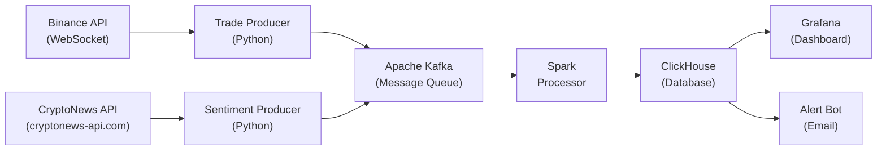
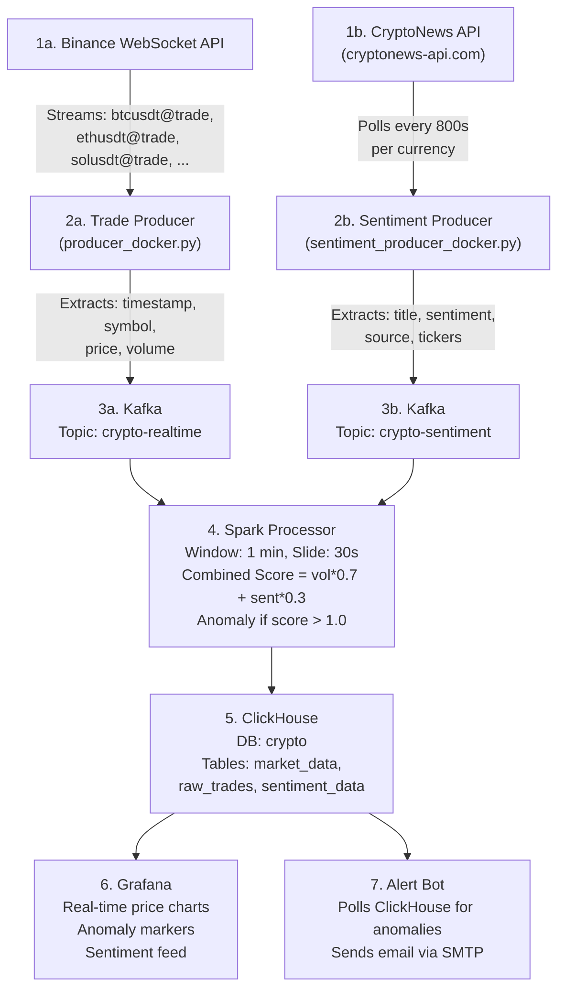
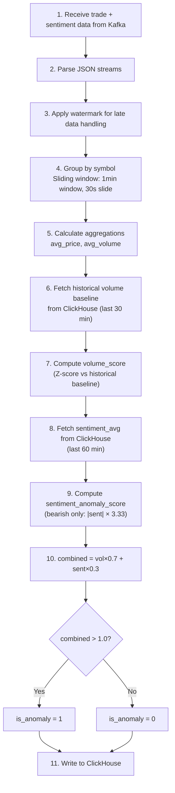

# Crypto Anomaly Detection Pipeline

A real-time Big Data pipeline for cryptocurrency market anomaly detection using Apache Kafka, Spark Structured Streaming, ClickHouse, and Grafana with automated email alerting.


---

## Table of Contents

- [Overview](#overview)
- [Architecture](#architecture)
- [Components](#components)
- [Prerequisites](#prerequisites)
- [Installation](#installation)
- [Configuration](#configuration)
- [Usage](#usage)
- [Grafana Dashboard](#grafana-dashboard)
- [Anomaly Detection](#anomaly-detection)
- [Email Alerts](#email-alerts)
- [Testing](#testing)
- [Troubleshooting](#troubleshooting)
- [Project Structure](#project-structure)
- [Tech Stack](#tech-stack)

---

## Overview

This project implements a **real-time streaming pipeline** that:

1. **Ingests** live cryptocurrency trade data from Binance WebSocket API
2. **Streams** data through Apache Kafka message broker
3. **Processes** data using Spark Structured Streaming with windowed aggregations
4. **Detects** anomalies using statistical methods (3-sigma rule)
5. **Stores** processed data in ClickHouse time-series database
6. **Visualizes** data in real-time Grafana dashboards
7. **Alerts** via email when anomalies are detected

### Key Features

- ✅ Real-time data ingestion from Binance
- ✅ Support for multiple trading pairs (BTC, ETH, SOL, DOGE, BNB, XRP)
- ✅ Windowed aggregations (1-minute windows, 30-second slides)
- ✅ Statistical anomaly detection (volume spikes)
- ✅ Time-series storage with ClickHouse
- ✅ Live Grafana dashboards
- ✅ Automated email alerts
- ✅ Fully containerized with Docker

---

## Architecture

### High-Level Architecture



### Data Flow



---

## Components

| Component | Image/Technology | Description | Port |
|-----------|------------------|-------------|------|
| **Zookeeper** | `confluentinc/cp-zookeeper:7.5.0` | Kafka coordination service | 2181 |
| **Kafka** | `confluentinc/cp-kafka:7.5.0` | Distributed message broker | 29092 |
| **ClickHouse** | `clickhouse/clickhouse-server:latest` | Column-oriented OLAP database | 8123, 9000 |
| **Grafana** | `grafana/grafana:latest` | Metrics visualization | 3000 |
| **Spark** | `apache/spark:3.5.1-python3` | Stream processing engine | - |
| **Producer** | Custom Python | Binance WebSocket → Kafka | - |
| **Sentiment Producer** | Custom Python | CryptoNews API → Kafka | - |
| **Alert Bot** | Custom Python | Anomaly email notifications | - |

### Trading Pairs Monitored

| Symbol | Pair | Description |
|--------|------|-------------|
| BTCUSDT | BTC/USDT | Bitcoin |
| ETHUSDT | ETH/USDT | Ethereum |
| SOLUSDT | SOL/USDT | Solana |
| DOGEUSDT | DOGE/USDT | Dogecoin |
| BNBUSDT | BNB/USDT | Binance Coin |
| XRPUSDT | XRP/USDT | Ripple |

---

## Prerequisites

- **Docker** (v20.10+)
- **Docker Compose** (v2.0+)
- **Python** (v3.9+) - for local testing
- **Git**
- **8GB+ RAM** recommended

### Required Ports

Ensure these ports are available:

| Port | Service |
|------|---------|
| 2181 | Zookeeper |
| 29092 | Kafka |
| 8123 | ClickHouse HTTP |
| 9000 | ClickHouse Native |
| 3000 | Grafana |

---

## Installation

### 1. Clone the Repository

```bash
git clone <repository-url>
cd crypto-bigdata-project
```

### 2. Set CryptoNews API Token (Optional)

```bash
# Without this, sentiment producer uses mock data
export CRYPTONEWS_API_TOKEN=your_token_here
```

### 3. Start All Services

```bash
docker compose up -d --build
```

### 4. Wait for Services to Initialize

```bash
# Check all services are running
docker compose ps
```

### 5. Initialize ClickHouse Schema

```bash
# Linux / macOS
docker exec -i crypto-bigdata-project-clickhouse-1 clickhouse-client < src/clickhouse_init.sql

# Windows PowerShell (< not supported)
Get-Content src/clickhouse_init.sql | docker exec -i crypto-bigdata-project-clickhouse-1 clickhouse-client --multiquery
```

### 6. Verify Data Flow

```bash
# Check trade producer logs
docker compose logs --tail=10 producer

# Check sentiment producer logs
docker compose logs --tail=10 sentiment-producer

# Check Spark processor logs
docker compose logs --tail=20 spark-processor

# Query ClickHouse for data
docker exec crypto-bigdata-project-clickhouse-1 clickhouse-client --query "SELECT count() FROM crypto.market_data"
docker exec crypto-bigdata-project-clickhouse-1 clickhouse-client --query "SELECT count() FROM crypto.raw_trades"
docker exec crypto-bigdata-project-clickhouse-1 clickhouse-client --query "SELECT count() FROM crypto.sentiment_data"
```

### 7. Access Grafana

- **URL**: http://localhost:3000
- **Username**: `admin`
- **Password**: `admin`

## Configuration

### Environment Variables

| Variable | Description | Default |
|----------|-------------|---------|
| `CLICKHOUSE_HOST` | ClickHouse server hostname | `localhost` |
| `CHECK_INTERVAL` | Alert check interval (seconds) | `5` |
| `MAX_ALERTS` | Maximum alerts to send | `1` |
| `SMTP_SERVER` | SMTP server hostname | `smtp.gmail.com` |
| `SMTP_PORT` | SMTP server port | `587` |
| `SMTP_USER` | SMTP username (if different from sender) | - |
| `SENDER_EMAIL` | Email sender address | - |
| `SENDER_PASSWORD` | SMTP password/API key | - |
| `RECEIVER_EMAIL` | Alert recipient email | - |
| `CRYPTONEWS_API_TOKEN` | CryptoNews API token (cryptonews-api.com) | *(empty, uses mock data)* |
| `SENTIMENT_POLL_INTERVAL` | Sentiment polling interval (seconds) | `800` |

### Email Alerts Configuration

Configure in `docker-compose.yml` under `alert-bot` service:

```yaml
environment:
  - SMTP_SERVER=smtp.mailersend.net
  - SMTP_PORT=2525
  - SMTP_USER=your_smtp_user
  - SENDER_EMAIL=your_sender@domain.com
  - SENDER_PASSWORD=your_password
  - RECEIVER_EMAIL=recipient@example.com
  - MAX_ALERTS=1
  - CHECK_INTERVAL=5
```

#### Supported Email Providers

| Provider | SMTP Server | Port | Notes |
|----------|-------------|------|-------|
| **MailerSend** | `smtp.mailersend.net` | 587/2525 | Requires domain verification |
| **Gmail** | `smtp.gmail.com` | 587 | Requires App Password |
| **SMTP2GO** | `mail.smtp2go.com` | 2525 | SMTP_USER required |
| **SendGrid** | `smtp.sendgrid.net` | 587 | Use API key as password |

### Adding New Trading Pairs

Edit `src/producer_docker.py`:

```python
TRADING_PAIRS = ['btcusdt', 'ethusdt', 'solusdt', 'dogeusdt', 'bnbusdt', 'xrpusdt', 'newpair']
```

---

## Grafana Dashboard Setup

### 1. Add ClickHouse Data Source

1. Go to **Configuration** → **Data Sources** → **Add data source**
2. Search for **ClickHouse**
3. Configure:
   - **Server address**: `clickhouse`
   - **Server port**: `9000`
   - **Protocol**: `Native`
   - **Database**: `crypto`
4. Click **Save & Test**

### 2. Create Price Chart Panel (Tick-by-Tick)

**Query for real-time price from raw trades:**

```sql
SELECT event_time AS time, symbol, price
FROM crypto.raw_trades
WHERE $__timeFilter(event_time)
ORDER BY time
```

### 3. Create OHLC Candlestick Panel

**Query for 1-minute candles:**

```sql
SELECT
    toStartOfMinute(event_time) AS time, symbol,
    argMin(price, event_time) AS open,
    max(price) AS high, min(price) AS low,
    argMax(price, event_time) AS close,
    sum(volume) AS total_volume
FROM crypto.raw_trades
WHERE $__timeFilter(event_time) AND symbol = 'BTCUSDT'
GROUP BY time, symbol
ORDER BY time
```

### 4. Create Anomaly Markers Panel

**Query for anomaly points:**

```sql
SELECT event_time AS time, symbol, price,
       volume_score, sentiment_avg, combined_score
FROM crypto.market_data
WHERE is_anomaly = 1 AND $__timeFilter(event_time)
ORDER BY time DESC
```

### 5. Dashboard Settings

- **Time Range**: Last 30 minutes
- **Refresh**: 5 seconds
- **Timezone**: Browser or Asia/Bangkok

> For the full 7-panel setup with all queries, see [`GRAFANA_SETUP.md`](GRAFANA_SETUP.md).

---

## Anomaly Detection

### Algorithm: Combined Scoring (Volume Z-Score + Sentiment)

The Spark processor uses a **multi-signal anomaly detection model** that combines volume statistics with news sentiment:

```
combined_score = volume_score × 0.7 + sentiment_anomaly_score × 0.3

Anomaly Condition: combined_score > 1.0
```

- **Volume Score** — Z-score comparing current window's avg volume against the historical baseline (last 30 min from ClickHouse)
- **Sentiment Score** — Bearish news amplifies anomaly signal; bullish/neutral has no effect

### Processing Parameters

| Parameter | Value | Description |
|-----------|-------|-------------|
| **Window Size** | 1 minute | Time window for aggregation |
| **Slide Interval** | 30 seconds | How often windows are evaluated |
| **Watermark** | 1 minute | Late data tolerance |
| **Volume Weight** | 0.7 | Volume contribution to combined score |
| **Sentiment Weight** | 0.3 | Sentiment contribution to combined score |
| **Threshold** | 1.0 | Combined score above this = anomaly |
| **Sentiment Lookback** | 60 minutes | Window for averaging sentiment data |
| **Volume Lookback** | 30 minutes | Window for historical volume baseline |

### Anomaly Detection Flow



### Why This Approach?

- **Historical baseline comparison:** Volume score compares the current window's avg volume against the mean/stddev from the last 30 minutes of stored data in ClickHouse — detecting windows that are genuinely unusual relative to recent history
- **Volume Z-Score (3-sigma):** 99.7% of data falls within 3 standard deviations — values beyond 3σ are statistically rare
- **Sentiment amplification:** Bearish news during a volume spike confirms a potential crash; pure volume spikes with bullish news may be healthy growth
- **Combined threshold at 1.0** means either a strong volume spike alone OR moderate volume + negative news can trigger an alert

---

## Email Alerts

### Alert Bot Behavior

1. Polls ClickHouse every `CHECK_INTERVAL` seconds
2. Queries for anomalies where `is_alerted = 0`
3. Sends email for each new anomaly
4. Marks anomaly as `is_alerted = 1` in database
5. Stops after `MAX_ALERTS` emails (prevents spam)

### Email Format

```
Subject: 🚨 Anomaly Detected: ETHUSDT

Body:
Anomaly Detected in Crypto Market

Pair: ETHUSDT
Price: $3,110.00
Volume: 999,999.99
Time: 2026-01-13 11:30:00

Check your dashboard for more details.

Alert 1 of 1
```

### Testing Email Configuration

```bash
# Test from inside container
docker exec crypto-bigdata-project-alert-bot-1 python /app/src/alert_bot.py --test

# Or run locally
python src/alert_bot.py --test
```

---

## Services Management

### Start/Stop Commands

```bash
# Start all services
docker compose up -d

# Start specific service
docker compose up -d producer

# Stop all services
docker compose down

# Stop and remove volumes
docker compose down -v

# Restart a service
docker compose restart alert-bot

# Rebuild and restart
docker compose up -d --build alert-bot
```

### View Logs

```bash
# All services
docker compose logs -f

# Specific service
docker compose logs -f spark-processor

# Last N lines
docker compose logs --tail=50 alert-bot
```

### Check Status

```bash
# Service status
docker compose ps

# Resource usage
docker stats
```

---

## Testing

### Simulate Anomaly Scenarios

The mock anomaly generator supports all combined scoring scenarios. Each scenario inserts both market data and sentiment data into ClickHouse.

```bash
# Show all available scenarios and usage
python src/mock_anomaly.py
```

#### Run All Scenarios at Once

```bash
# Inserts 6 scenarios: 4 anomalies + 2 normal records
python src/mock_anomaly.py all
```

#### Individual Scenarios

```bash
# Scenario 1: Normal trading, neutral news → NORMAL (no alert)
python src/mock_anomaly.py normal

# Scenario 2: Volume spike (3σ), neutral news → ANOMALY (triggers alert)
python src/mock_anomaly.py volume_spike

# Scenario 3: Volume spike (3σ), bullish news → ANOMALY (triggers alert)
python src/mock_anomaly.py volume_bullish

# Scenario 4: Moderate volume (2σ) + bearish news → ANOMALY (combined triggers)
python src/mock_anomaly.py combined

# Scenario 5: Normal volume + very bearish news → ANOMALY (sentiment-driven)
python src/mock_anomaly.py sentiment_only

# Scenario 6: Slightly elevated + mildly bearish → NORMAL (boundary, no alert)
python src/mock_anomaly.py borderline
```

#### Custom Scenario

```bash
# Usage: python src/mock_anomaly.py custom <SYMBOL> <PRICE> <VOLUME> <VOL_SCORE> <SENT_AVG> <COMBINED>
python src/mock_anomaly.py custom BTCUSDT 95000 500000 3.5 -0.8 2.95
python src/mock_anomaly.py custom ETHUSDT 2900 300000 2.0 -0.6 2.00
python src/mock_anomaly.py custom DOGEUSDT 0.15 200 1.0 -0.3 1.00
```

#### Scenario Reference Table

| Scenario | vol_score | sent_avg | combined | Result |
|---|---|---|---|---|
| `normal` | 0.5 | +0.1 | 0.35 | NORMAL |
| `volume_spike` | 3.0 | 0.0 | 2.10 | **ANOMALY** |
| `volume_bullish` | 3.0 | +0.7 | 2.10 | **ANOMALY** |
| `combined` | 2.0 | -0.6 | 2.00 | **ANOMALY** |
| `sentiment_only` | 0.5 | -1.0 | 1.35 | **ANOMALY** |
| `borderline` | 1.0 | -0.3 | 1.00 | NORMAL |

### Test Email Alert

```bash
docker exec crypto-bigdata-project-alert-bot-1 python /app/src/alert_bot.py --test
```

### Verify Anomalies Were Inserted

```bash
# View all anomalies with scores
docker exec crypto-bigdata-project-clickhouse-1 clickhouse-client \
  --query "SELECT event_time, symbol, price, volume_score, sentiment_avg, combined_score, is_anomaly, is_alerted FROM crypto.market_data WHERE is_anomaly = 1 ORDER BY event_time DESC"

# View sentiment data
docker exec crypto-bigdata-project-clickhouse-1 clickhouse-client \
  --query "SELECT event_time, symbol, sentiment_score, sentiment_label, title FROM crypto.sentiment_data ORDER BY event_time DESC LIMIT 10"

# Reset: delete all mock data to re-run scenarios
docker exec crypto-bigdata-project-clickhouse-1 clickhouse-client \
  --query "ALTER TABLE crypto.market_data DELETE WHERE volume_score > 0 OR sentiment_avg != 0"
docker exec crypto-bigdata-project-clickhouse-1 clickhouse-client \
  --query "ALTER TABLE crypto.sentiment_data DELETE WHERE source = 'cryptonews_mock'"
```

### ClickHouse Queries

```bash
# Count all records
docker exec crypto-bigdata-project-clickhouse-1 clickhouse-client \
  --query "SELECT count() FROM crypto.market_data"
docker exec crypto-bigdata-project-clickhouse-1 clickhouse-client \
  --query "SELECT count() FROM crypto.raw_trades"

# View recent prices (tick-by-tick)
docker exec crypto-bigdata-project-clickhouse-1 clickhouse-client \
  --query "SELECT event_time, symbol, price FROM crypto.raw_trades ORDER BY event_time DESC LIMIT 10"

# View recent aggregated data
docker exec crypto-bigdata-project-clickhouse-1 clickhouse-client \
  --query "SELECT * FROM crypto.market_data ORDER BY event_time DESC LIMIT 10"

# View anomalies
docker exec crypto-bigdata-project-clickhouse-1 clickhouse-client \
  --query "SELECT * FROM crypto.market_data WHERE is_anomaly = 1 ORDER BY event_time DESC"

# Count by symbol
docker exec crypto-bigdata-project-clickhouse-1 clickhouse-client \
  --query "SELECT symbol, count() as cnt FROM crypto.market_data GROUP BY symbol ORDER BY cnt DESC"

# Delete all anomalies
docker exec crypto-bigdata-project-clickhouse-1 clickhouse-client \
  --query "ALTER TABLE crypto.market_data DELETE WHERE is_anomaly = 1"

# Describe table schema
docker exec crypto-bigdata-project-clickhouse-1 clickhouse-client \
  --query "DESCRIBE crypto.market_data"
```

### Kafka Commands

```bash
# List topics
docker exec crypto-bigdata-project-kafka-1 kafka-topics --list --bootstrap-server localhost:9092

# Consume messages
docker exec crypto-bigdata-project-kafka-1 kafka-console-consumer \
  --bootstrap-server localhost:9092 --topic crypto-realtime --from-beginning --max-messages 5
```

---

## Database Schema

### Table: `crypto.market_data`

```sql
CREATE DATABASE IF NOT EXISTS crypto;

CREATE TABLE IF NOT EXISTS crypto.market_data (
    event_time DateTime,
    symbol String,
    price Float64,
    volume Float64,
    is_anomaly UInt8,
    is_alerted UInt8 DEFAULT 0,
    volume_score Float64 DEFAULT 0,
    sentiment_avg Float64 DEFAULT 0,
    combined_score Float64 DEFAULT 0
) ENGINE = ReplacingMergeTree()
PARTITION BY toYYYYMM(event_time)
ORDER BY (symbol, event_time);
```

### Table: `crypto.raw_trades`

```sql
CREATE TABLE IF NOT EXISTS crypto.raw_trades (
    event_time DateTime64(3),
    symbol String,
    price Float64,
    volume Float64
) ENGINE = MergeTree()
PARTITION BY toYYYYMM(event_time)
ORDER BY (symbol, event_time);
```

| Column | Type | Description |
|--------|------|-------------|
| `event_time` | DateTime64(3) | Trade timestamp with millisecond precision |
| `symbol` | String | Trading pair (e.g., BTCUSDT) |
| `price` | Float64 | Exact trade price in USDT |
| `volume` | Float64 | Trade quantity |

### Table: `crypto.sentiment_data`

```sql
CREATE TABLE IF NOT EXISTS crypto.sentiment_data (
    event_time DateTime,
    symbol String,
    source String,
    post_id String,
    title String,
    kind String,
    sentiment_score Float64,
    sentiment_label String,
    votes_positive UInt32,
    votes_negative UInt32,
    votes_important UInt32,
    url String,
    published_at String
) ENGINE = ReplacingMergeTree()
PARTITION BY toYYYYMM(event_time)
ORDER BY (symbol, event_time, post_id);
```

### Column Descriptions — `market_data`

| Column | Type | Description |
|--------|------|-------------|
| `event_time` | DateTime | UTC timestamp of the aggregated window |
| `symbol` | String | Trading pair symbol (e.g., BTCUSDT) |
| `price` | Float64 | Average price during the window |
| `volume` | Float64 | Average volume during the window |
| `is_anomaly` | UInt8 | 1 if combined score > 1.0, else 0 |
| `is_alerted` | UInt8 | 1 if email alert was sent, else 0 |
| `volume_score` | Float64 | Volume Z-score vs historical baseline (0 = normal, 3+ = extreme) |
| `sentiment_avg` | Float64 | Average sentiment in lookback window [-1, 1] (last 60 min) |
| `combined_score` | Float64 | Final weighted anomaly score |

---

## Project Structure

```
crypto-bigdata-project/
├── README.md                        # This file
├── BUSINESS_LOGIC.md                # Business logic documentation
├── TECHNICAL_SPEC.md                # Technical specification
├── CLICKHOUSE_DATABASE.md           # ClickHouse database documentation
├── GRAFANA_SETUP.md                 # Grafana dashboard setup guide
├── docker-compose.yml               # Docker services configuration
├── Dockerfile.producer              # Producer container build
├── Dockerfile.alertbot              # Alert bot container build
├── Dockerfile.sentiment             # Sentiment producer container build
├── requirements.txt                 # Python dependencies
│
├── clickhouse_config/
│   └── users.xml                    # ClickHouse user configuration
│
└── src/
    ├── producer.py                  # Local Binance WebSocket producer
    ├── producer_docker.py           # Docker-compatible producer
    ├── sentiment_producer.py        # Local sentiment producer (cryptonews-api.com)
    ├── sentiment_producer_docker.py # Docker-compatible sentiment producer
    ├── spark_processor.py           # Local Spark processor
    ├── spark_processor_docker.py    # Docker-compatible Spark processor
    ├── spark_processor_sentiment_docker.py # Docker Spark with combined scoring
    ├── alert_bot.py                 # Anomaly email alert bot
    ├── mock_anomaly.py              # Mock anomaly scenario generator
    └── clickhouse_init.sql          # ClickHouse schema initialization
```

## Troubleshooting

### Common Issues

#### 1. Spark Native IO Error on Windows

**Error**: `NativeIO$Windows.access0` error when running Spark locally

**Solution**: Run Spark inside Docker instead of locally. The `spark-processor` service in Docker Compose handles this automatically.

#### 2. Email Rate Limiting

**Error**: `(429, 'Too many requests')` or `(554, 'Too many requests')`

**Solution**: 
- Wait 2-5 minutes for rate limit to reset
- Reduce `CHECK_INTERVAL` to slow down polling
- The alert bot now tracks sent alerts to prevent duplicates

#### 3. ClickHouse Column Not Found

**Error**: `Column 'is_alerted' not found`

**Solution**: Add the missing column:
```bash
docker exec crypto-bigdata-project-clickhouse-1 clickhouse-client \
  --query "ALTER TABLE crypto.market_data ADD COLUMN IF NOT EXISTS is_alerted UInt8 DEFAULT 0"
```

#### 4. Kafka Connection Refused

**Error**: `Connection refused` when producer tries to connect

**Solution**: 
- Ensure Kafka is running: `docker compose ps kafka`
- Wait for Kafka to fully start (30-60 seconds)
- Check Kafka logs: `docker compose logs kafka`

#### 5. ClickHouse Insert Error (400 Bad Request)

**Error**: `HTTP Error 400: Bad Request`

**Solution**: Schema mismatch. Ensure INSERT matches table columns:
```sql
-- Check current schema
DESCRIBE crypto.market_data
```

#### 6. Grafana Can't Connect to ClickHouse

**Solution**:
- Use hostname `clickhouse` (not `localhost`) inside Docker network
- Ensure ClickHouse is running
- Check port: 9000 for native, 8123 for HTTP

#### 7. No Data in Grafana

**Checklist**:
1. Check producer is running: `docker compose logs producer`
2. Check Spark processor: `docker compose logs spark-processor`
3. Query ClickHouse directly to verify data exists
4. Check Grafana time range (set to "Last 15 minutes")

#### 8. Alert Bot Sending Duplicate Emails

**Solution**: 
- Delete existing anomalies: `ALTER TABLE crypto.market_data DELETE WHERE is_anomaly = 1`
- Rebuild alert-bot: `docker compose up -d --build alert-bot`

### Useful Debug Commands

```bash
# Check all container status
docker compose ps

# View all logs
docker compose logs -f

# Restart everything
docker compose down && docker compose up -d

# Check resource usage
docker stats

# Enter ClickHouse CLI
docker exec -it crypto-bigdata-project-clickhouse-1 clickhouse-client

# Check Kafka topics
docker exec crypto-bigdata-project-kafka-1 kafka-topics --list --bootstrap-server localhost:9092
```

---

## Tech Stack

| Category | Technology | Version |
|----------|------------|---------|
| **Data Source** | Binance WebSocket API | - |
| **Sentiment Source** | CryptoNews API (cryptonews-api.com) | Premium |
| **Message Broker** | Apache Kafka | 7.5.0 |
| **Stream Processing** | Apache Spark | 3.5.1 |
| **Database** | ClickHouse | Latest |
| **Visualization** | Grafana | Latest |
| **Alerting** | Python SMTP | - |
| **Container Runtime** | Docker | 20.10+ |
| **Language** | Python | 3.9+ |

### Python Dependencies

```
kafka-python-ng
websocket-client
clickhouse-connect
pyspark
requests
pandas
numpy
```

---

## Performance Considerations

- **Kafka**: Single partition setup for simplicity; scale partitions for higher throughput
- **Spark**: 2 shuffle partitions configured; increase for larger datasets
- **ClickHouse**: MergeTree engine with monthly partitioning; efficient for time-series queries
- **Memory**: Recommend 8GB+ RAM for running all services

---

## Future Improvements

- [ ] Add more anomaly detection algorithms (Isolation Forest, LSTM)
- [ ] Support for more trading pairs
- [ ] Telegram/Slack alert integration
- [ ] Historical data backfill
- [ ] Kubernetes deployment
- [ ] Prometheus metrics export
- [ ] Multi-exchange support (Coinbase, Kraken)

---

## License

MIT License

---

## Contributing

1. Fork the repository
2. Create a feature branch
3. Commit your changes
4. Push to the branch
5. Create a Pull Request

---

## Contact

For questions or issues, please open a GitHub issue.
