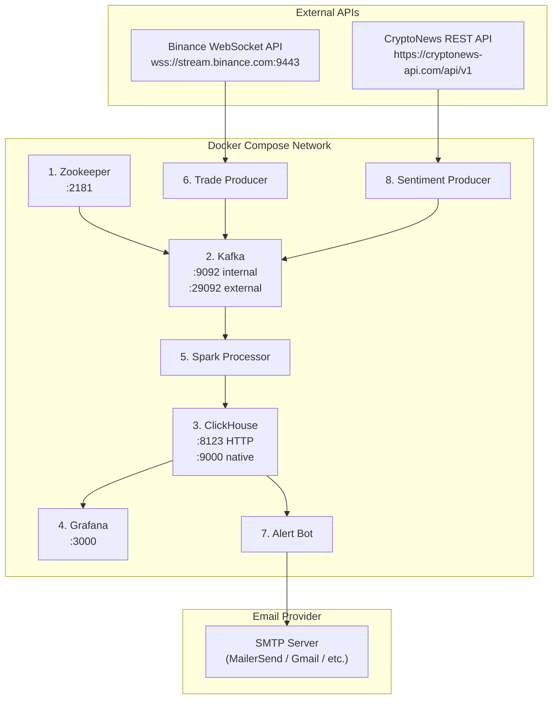
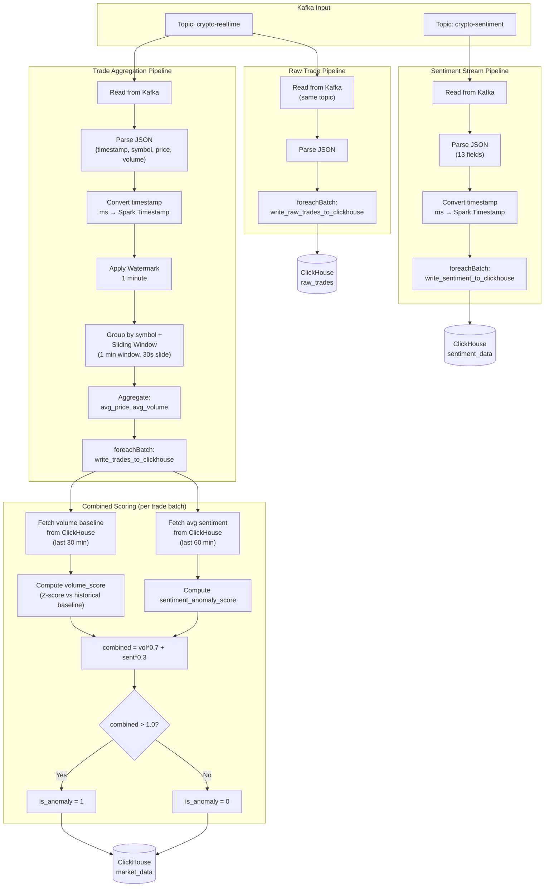
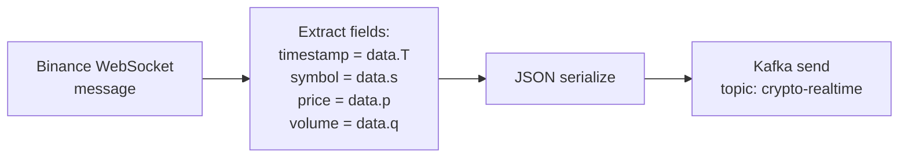
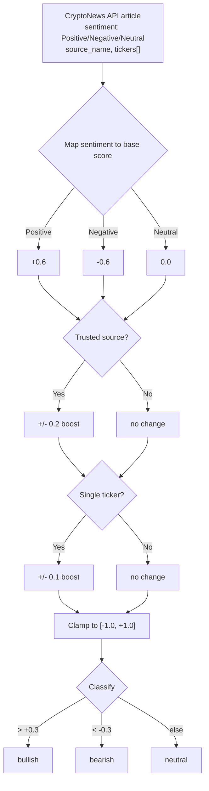
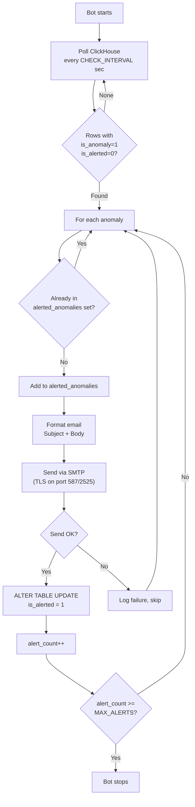
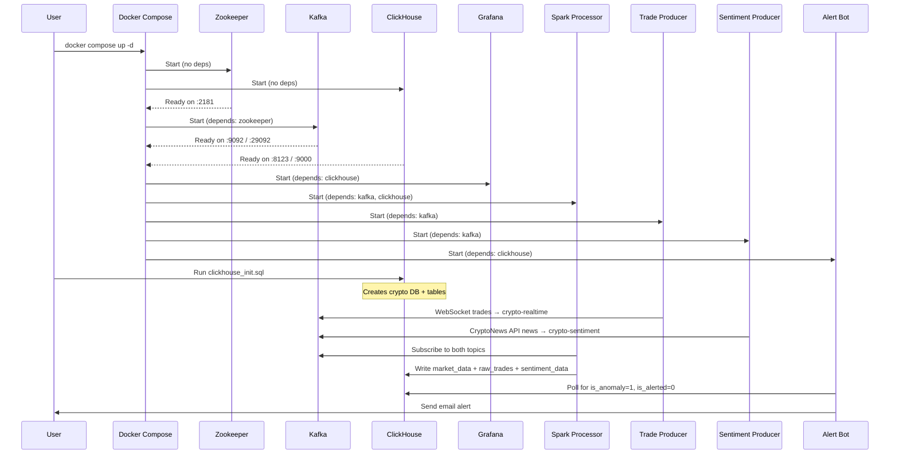

# Technical Specification

## Crypto Anomaly Detection Pipeline — Infrastructure, Configuration & Data Flow

---

## 1. System Overview

| Property | Value |
|---|---|
| **Architecture** | Kappa (stream-only, no batch layer) |
| **Total Services** | 8 Docker containers |
| **Language** | Python 3.11 |
| **Orchestration** | Docker Compose (single-node) |
| **Streams** | 2 Kafka topics (trade + sentiment) |
| **Database** | ClickHouse (3 tables: `market_data`, `raw_trades`, `sentiment_data`) |
| **Visualization** | Grafana |

---

## 2. Service Inventory

### 2.1. Container Map



### 2.2. Service Detail Table

| # | Service | Image / Dockerfile | Ports | Depends On | Restart |
|---|---|---|---|---|---|
| 1 | `zookeeper` | `confluentinc/cp-zookeeper:7.5.0` | 2181 | — | — |
| 2 | `kafka` | `confluentinc/cp-kafka:7.5.0` | 29092 (host) → 29092 (container) | zookeeper | — |
| 3 | `clickhouse` | `clickhouse/clickhouse-server:latest` | 8123, 9000 | — | — |
| 4 | `grafana` | `grafana/grafana:latest` | 3000 | clickhouse | — |
| 5 | `spark-processor` | `apache/spark:3.5.1-python3` | — | kafka, clickhouse | — |
| 6 | `producer` | `Dockerfile.producer` (python:3.11-slim) | — | kafka | unless-stopped |
| 7 | `alert-bot` | `Dockerfile.alertbot` (python:3.11-slim) | — | clickhouse | unless-stopped |
| 8 | `sentiment-producer` | `Dockerfile.sentiment` (python:3.11-slim) | — | kafka | unless-stopped |

---

## 3. Network Configuration

### 3.1. Internal Docker Network (Default Bridge)

All services communicate on the default Docker Compose bridge network using **container hostnames**.

| Source | Destination | Hostname | Port | Protocol |
|---|---|---|---|---|
| Producer → Kafka | kafka | `kafka` | 9092 | PLAINTEXT (TCP) |
| Sentiment Producer → Kafka | kafka | `kafka` | 9092 | PLAINTEXT (TCP) |
| Spark → Kafka | kafka | `kafka` | 9092 | PLAINTEXT (TCP) |
| Spark → ClickHouse | clickhouse | `clickhouse` | 8123 | HTTP |
| Alert Bot → ClickHouse | clickhouse | `clickhouse` | 9000 | Native TCP |
| Grafana → ClickHouse | clickhouse | `clickhouse` | 8123 | HTTP |
| Kafka → Zookeeper | zookeeper | `zookeeper` | 2181 | TCP |

### 3.2. External (Host) Access

| Service | Host URL | Purpose |
|---|---|---|
| Kafka | `localhost:29092` | Local development / debugging |
| ClickHouse HTTP | `localhost:8123` | SQL queries, REST API |
| ClickHouse Native | `localhost:9000` | `clickhouse-client`, `clickhouse-connect` |
| Grafana | `http://localhost:3000` | Dashboard UI |

### 3.3. Outbound Connections

| Source | Destination | Protocol | Rate |
|---|---|---|---|
| Trade Producer | `wss://stream.binance.com:9443` | WebSocket (TLS) | Persistent |
| Sentiment Producer | `https://cryptonews-api.com/api/v1` | HTTPS REST | 6 req / 60s |
| Alert Bot | SMTP server (configurable) | SMTP + TLS (port 587 or 2525) | On anomaly |

---

## 4. Kafka Configuration

### 4.1. Broker Settings

| Parameter | Value | Source |
|---|---|---|
| `KAFKA_BROKER_ID` | `1` | docker-compose.yml |
| `KAFKA_ZOOKEEPER_CONNECT` | `zookeeper:2181` | docker-compose.yml |
| `KAFKA_OFFSETS_TOPIC_REPLICATION_FACTOR` | `1` | docker-compose.yml |
| Listener (internal) | `PLAINTEXT://kafka:9092` | For inter-container traffic |
| Listener (external) | `PLAINTEXT_HOST://localhost:29092` | For host-machine access |

### 4.2. Topics

| Topic | Producer | Consumer | Partitions | Data Format |
|---|---|---|---|---|
| `crypto-realtime` | Trade Producer | Spark Processor | 1 (auto-created) | JSON |
| `crypto-sentiment` | Sentiment Producer | Spark Processor | 1 (auto-created) | JSON |

### 4.3. Message Schemas

**`crypto-realtime` (Trade)**

```json
{
  "timestamp": 1704110400000,
  "symbol": "BTCUSDT",
  "price": 95123.45,
  "volume": 0.0523
}
```

**`crypto-sentiment` (Sentiment)**

```json
{
  "timestamp": 1704110400000,
  "symbol": "BTCUSDT",
  "source": "cryptonews-api",
  "post_id": "12345678",
  "title": "Bitcoin surges past $95K amid ETF inflows",
  "kind": "news",
  "sentiment_score": 0.72,
  "sentiment_label": "bullish",
  "votes_positive": 1,
  "votes_negative": 0,
  "votes_important": 0,
  "url": "https://example.com/article",
  "published_at": "2026-01-01T12:00:00Z"
}
```

---

## 5. ClickHouse Configuration

### 5.1. Server Settings

| Parameter | Value |
|---|---|
| Image | `clickhouse/clickhouse-server:latest` |
| HTTP Port | 8123 |
| Native Port | 9000 |
| Database | `crypto` |
| User | `default` (no password) |
| Network Access | `::/0` (all IPs) |
| Access Management | Enabled |
| File Descriptor Limit | 262144 (soft + hard) |

### 5.2. User Configuration

File: `clickhouse_config/users.xml`

```xml
<?xml version="1.0"?>
<clickhouse>
    <users>
        <default>
            <password></password>
            <networks>
                <ip>::/0</ip>
            </networks>
            <profile>default</profile>
            <quota>default</quota>
            <access_management>1</access_management>
        </default>
    </users>
</clickhouse>
```

### 5.3. Table: `crypto.market_data`

```sql
CREATE TABLE IF NOT EXISTS market_data (
    event_time DateTime,
    symbol String,
    price Float64,
    volume Float64,
    is_anomaly UInt8,
    is_alerted UInt8 DEFAULT 0,
    volume_score Float64 DEFAULT 0,
    sentiment_avg Float64 DEFAULT 0,
    combined_score Float64 DEFAULT 0
) ENGINE = ReplacingMergeTree()
PARTITION BY toYYYYMM(event_time)
ORDER BY (symbol, event_time);
```

| Column | Type | Default | Description |
|---|---|---|---|
| `event_time` | DateTime | — | End of Spark aggregation window |
| `symbol` | String | — | Trading pair (e.g., BTCUSDT) |
| `price` | Float64 | — | Average price in the window |
| `volume` | Float64 | — | Average volume in the window |
| `is_anomaly` | UInt8 | — | 1 = anomaly, 0 = normal |
| `is_alerted` | UInt8 | 0 | 1 = email sent, 0 = pending |
| `volume_score` | Float64 | 0 | Volume Z-score (vs historical baseline, last 30 min) |
| `sentiment_avg` | Float64 | 0 | Average sentiment [-1, 1] |
| `combined_score` | Float64 | 0 | Weighted final score |

**Engine:** `ReplacingMergeTree()` — deduplicates on merge by primary key.
**Partition key:** `toYYYYMM(event_time)` — one partition per month.
**Order key:** `(symbol, event_time)` — optimized for per-symbol time-range queries.

### 5.4. Table: `crypto.sentiment_data`

```sql
CREATE TABLE IF NOT EXISTS sentiment_data (
    event_time DateTime,
    symbol String,
    source String,
    post_id String,
    title String,
    kind String,
    sentiment_score Float64,
    sentiment_label String,
    votes_positive UInt32,
    votes_negative UInt32,
    votes_important UInt32,
    url String,
    published_at String
) ENGINE = ReplacingMergeTree()
PARTITION BY toYYYYMM(event_time)
ORDER BY (symbol, event_time, post_id);
```

**Order key:** `(symbol, event_time, post_id)` — `post_id` prevents duplicate news items.

### 5.5. Table: `crypto.raw_trades`

```sql
CREATE TABLE IF NOT EXISTS raw_trades (
    event_time DateTime64(3),
    symbol String,
    price Float64,
    volume Float64
) ENGINE = MergeTree()
PARTITION BY toYYYYMM(event_time)
ORDER BY (symbol, event_time);
```

| Column | Type | Default | Description |
|---|---|---|---|
| `event_time` | DateTime64(3) | — | Trade timestamp with millisecond precision |
| `symbol` | String | — | Trading pair (e.g., BTCUSDT) |
| `price` | Float64 | — | Exact trade price in USDT |
| `volume` | Float64 | — | Trade quantity |

**Engine:** `MergeTree()` — no deduplication, every tick is stored.
**Partition key:** `toYYYYMM(event_time)` — monthly partitions.
**Order key:** `(symbol, event_time)` — optimized for time-series price charts.

### 5.6. Initialization

```bash
# Linux / macOS
docker exec -i crypto-bigdata-project-clickhouse-1 clickhouse-client < src/clickhouse_init.sql

# Windows PowerShell (< not supported)
Get-Content src/clickhouse_init.sql | docker exec -i crypto-bigdata-project-clickhouse-1 clickhouse-client --multiquery
```

---

## 6. Spark Configuration

### 6.1. Deployment Settings

| Parameter | Value | Source |
|---|---|---|
| Image | `apache/spark:3.5.1-python3` | docker-compose.yml |
| App Name | `CryptoAnomalyDetectionWithSentiment` | spark_processor_sentiment_docker.py |
| Shuffle Partitions | `2` | spark-submit --conf |
| Ivy Cache | `/tmp/.ivy2` | spark-submit --conf |
| Kafka Connector | `org.apache.spark:spark-sql-kafka-0-10_2.12:3.5.1` | spark-submit --packages |
| Log Level | `WARN` | SparkContext config |
| Source Volume | `./src:/app/src` | docker-compose.yml |
| Working Dir | `/app` | docker-compose.yml |
| User | `root` | docker-compose.yml |

### 6.2. Spark Submit Command

```bash
/opt/spark/bin/spark-submit \
  --packages org.apache.spark:spark-sql-kafka-0-10_2.12:3.5.1 \
  --conf spark.sql.shuffle.partitions=2 \
  --conf spark.driver.extraJavaOptions=-Divy.cache.dir=/tmp/.ivy2 \
  /app/src/spark_processor_sentiment_docker.py
```

### 6.3. Stream Processing Parameters

| Parameter | Value | Description |
|---|---|---|
| `startingOffsets` | `latest` | Only process new messages (no replay) |
| Watermark | 1 minute | Late data tolerance before discard |
| Window Size | 1 minute | Aggregation time window |
| Slide Interval | 30 seconds | Overlapping window step |
| Output Mode (trade) | `update` | Emit updated aggregation results |
| Output Mode (sentiment) | `append` | Emit each sentiment record once |
| Output Mode (raw trades) | `append` | Emit each raw trade once |
| Checkpoint (trade) | `/tmp/spark-checkpoint-trades` | Fault-tolerance state |
| Checkpoint (sentiment) | `/tmp/spark-checkpoint-sentiment` | Fault-tolerance state |
| Checkpoint (raw trades) | `/tmp/spark-checkpoint-raw-trades` | Fault-tolerance state |
| `VOLUME_LOOKBACK_MINUTES` | 30 | Historical window for volume baseline |
| `SENTIMENT_LOOKBACK_MINUTES` | 60 | Historical window for sentiment average |
| `COMBINED_THRESHOLD` | 1.0 | Score above this triggers anomaly |

### 6.4. Data Flow Through Spark



---

## 7. Producer Configuration

### 7.1. Trade Producer

| Parameter | Value | Source |
|---|---|---|
| Dockerfile | `Dockerfile.producer` | docker-compose.yml |
| Base Image | `python:3.11-slim` | Dockerfile.producer |
| Dependencies | `kafka-python-ng`, `websocket-client` | Dockerfile.producer |
| Script | `src/producer_docker.py` | Dockerfile.producer |
| Kafka Bootstrap | `kafka:9092` | producer_docker.py |
| Kafka Topic | `crypto-realtime` | producer_docker.py |
| WebSocket URL | `wss://stream.binance.com:9443/stream?streams=...` | producer_docker.py |
| Trading Pairs | `btcusdt`, `ethusdt`, `solusdt`, `dogeusdt`, `bnbusdt`, `xrpusdt` | producer_docker.py |
| Stream Type | `@trade` (individual trade events) | producer_docker.py |
| Retry on Kafka fail | Infinite loop with 5s sleep | producer_docker.py |

**Data extraction per trade event:**



### 7.2. Sentiment Producer

| Parameter | Value | Source |
|---|---|---|
| Dockerfile | `Dockerfile.sentiment` | docker-compose.yml |
| Base Image | `python:3.11-slim` | Dockerfile.sentiment |
| Dependencies | `kafka-python-ng`, `requests` | Dockerfile.sentiment |
| Script | `src/sentiment_producer_docker.py` | Dockerfile.sentiment |
| Kafka Bootstrap | `kafka:9092` | sentiment_producer_docker.py |
| Kafka Topic | `crypto-sentiment` | sentiment_producer_docker.py |
| API Base URL | `https://cryptonews-api.com/api/v1` | sentiment_producer_docker.py |
| API Token | `CRYPTONEWS_API_TOKEN` env var | docker-compose.yml |
| Currencies | `BTC`, `ETH`, `SOL`, `DOGE`, `BNB`, `XRP` | sentiment_producer_docker.py |
| Poll Interval | 800 seconds (env: `SENTIMENT_POLL_INTERVAL`) | docker-compose.yml |
| Rate Limit Delay | 2 seconds between currencies | sentiment_producer_docker.py |
| Dedup Cache Size | 10,000 post IDs (in-memory set) | sentiment_producer_docker.py |
| Fallback | Mock data if `CRYPTONEWS_API_TOKEN` is empty | sentiment_producer_docker.py |

**API Request Parameters:**

| Param | Value | Description |
|---|---|---|
| `token` | API token | Authentication |
| `tickers` | e.g., `BTC` | Filter by coin |
| `items` | `3` | Number of news items per request (1-100) |

**Sentiment Score Calculation:**



---

## 8. Alert Bot Configuration

### 8.1. Settings

| Parameter | Value | Env Var | Default |
|---|---|---|---|
| ClickHouse Host | `clickhouse` | `CLICKHOUSE_HOST` | `localhost` |
| Check Interval | 5 seconds | `CHECK_INTERVAL` | `5` |
| Max Alerts | 1 | `MAX_ALERTS` | `1` |
| SMTP Server | `smtp.mailersend.net` | `SMTP_SERVER` | `smtp.gmail.com` |
| SMTP Port | 2525 | `SMTP_PORT` | `587` |
| SMTP User | (configured) | `SMTP_USER` | `` |
| Sender Email | (configured) | `SENDER_EMAIL` | `your_email@gmail.com` |
| Sender Password | (configured) | `SENDER_PASSWORD` | `your_app_password` |
| Receiver Email | (configured) | `RECEIVER_EMAIL` | `receiver_email@example.com` |

### 8.2. Dockerfile

```dockerfile
FROM python:3.11-slim
WORKDIR /app
RUN pip install --no-cache-dir clickhouse-connect
COPY src/alert_bot.py /app/alert_bot.py
CMD ["python", "-u", "alert_bot.py"]
```

### 8.3. Polling Query

```sql
SELECT symbol, price, volume, event_time
FROM crypto.market_data
WHERE is_anomaly = 1 AND is_alerted = 0
ORDER BY event_time ASC
LIMIT 10
```

### 8.4. Mark-as-Alerted Mutation

```sql
ALTER TABLE crypto.market_data
UPDATE is_alerted = 1
WHERE event_time = '{event_time}' AND symbol = '{symbol}' AND is_anomaly = 1
```

### 8.5. Alert Lifecycle



---

## 9. Grafana Configuration

### 9.1. Settings

| Parameter | Value |
|---|---|
| Image | `grafana/grafana:latest` |
| Port | 3000 |
| Admin User | `admin` |
| Admin Password | `admin` (env: `GF_SECURITY_ADMIN_PASSWORD`) |

### 9.2. ClickHouse Data Source Setup

| Field | Value |
|---|---|
| Type | ClickHouse |
| Server Address | `clickhouse` (Docker) or `localhost` (host) |
| Server Port | 8123 |
| Protocol | HTTP |
| Username | `default` |
| Password | *(empty)* |
| Default Database | `crypto` |

### 9.3. Recommended Dashboard Panels

**Panel 1: Tick-by-Tick Price (Time Series)**

```sql
SELECT event_time AS time, symbol, price
FROM crypto.raw_trades
WHERE $__timeFilter(event_time)
ORDER BY time
```

**Panel 2: OHLC Candlestick (1-Minute Candles)**

```sql
SELECT
    toStartOfMinute(event_time) AS time, symbol,
    argMin(price, event_time) AS open,
    max(price) AS high, min(price) AS low,
    argMax(price, event_time) AS close,
    sum(volume) AS total_volume
FROM crypto.raw_trades
WHERE $__timeFilter(event_time) AND symbol = 'BTCUSDT'
GROUP BY time, symbol
ORDER BY time
```

**Panel 3: Anomaly Score Breakdown (Time Series)**

```sql
SELECT event_time AS time, symbol,
       volume_score, sentiment_avg, combined_score
FROM crypto.market_data
WHERE $__timeFilter(event_time) AND symbol = 'BTCUSDT'
ORDER BY time
```

**Panel 4: Anomaly Events (Table)**

```sql
SELECT event_time, symbol, price, volume,
       volume_score, sentiment_avg, combined_score
FROM crypto.market_data
WHERE is_anomaly = 1
ORDER BY event_time DESC
LIMIT 50
```

**Panel 5: Sentiment Feed (Table)**

```sql
SELECT event_time, symbol, sentiment_score,
       sentiment_label, title
FROM crypto.sentiment_data
WHERE $__timeFilter(event_time)
ORDER BY event_time DESC
LIMIT 30
```

**Panel 6: Anomaly Count by Symbol (Bar Chart)**

```sql
SELECT symbol, count() AS anomaly_count
FROM crypto.market_data
WHERE is_anomaly = 1 AND $__timeFilter(event_time)
GROUP BY symbol
ORDER BY anomaly_count DESC
```

---

## 10. Dockerfile Reference

### 10.1. Dockerfile.producer

```dockerfile
FROM python:3.11-slim
WORKDIR /app
RUN pip install --no-cache-dir kafka-python-ng websocket-client
COPY src/producer_docker.py /app/producer.py
CMD ["python", "-u", "producer.py"]
```

### 10.2. Dockerfile.alertbot

```dockerfile
FROM python:3.11-slim
WORKDIR /app
RUN pip install --no-cache-dir clickhouse-connect
COPY src/alert_bot.py /app/alert_bot.py
CMD ["python", "-u", "alert_bot.py"]
```

### 10.3. Dockerfile.sentiment

```dockerfile
FROM python:3.11-slim
WORKDIR /app
RUN pip install --no-cache-dir kafka-python-ng requests
COPY src/sentiment_producer_docker.py /app/sentiment_producer.py
CMD ["python", "-u", "sentiment_producer.py"]
```

---

## 11. Python Dependencies

### 11.1. requirements.txt (Local Development)

| Package | Version | Used By |
|---|---|---|
| `kafka-python-ng` | latest | Producer, Simple Processor |
| `websocket-client` | 1.6.1 | Trade Producer |
| `pyspark` | 3.5.0 | Spark Processor |
| `clickhouse-connect` | latest | Alert Bot, Mock Anomaly, Simple Processor |
| `pandas` | latest | Data analysis utilities |
| `numpy` | latest | Numerical operations |
| `requests` | latest | Sentiment Producer |

### 11.2. Per-Container Dependencies

| Container | Packages | Install Method |
|---|---|---|
| `producer` | `kafka-python-ng`, `websocket-client` | Dockerfile RUN pip install |
| `alert-bot` | `clickhouse-connect` | Dockerfile RUN pip install |
| `sentiment-producer` | `kafka-python-ng`, `requests` | Dockerfile RUN pip install |
| `spark-processor` | Kafka connector (Spark package) | spark-submit --packages |

---

## 12. Environment Variables Reference

### 12.1. Complete Variable Map

| Variable | Service | Default | Required | Description |
|---|---|---|---|---|
| `CRYPTONEWS_API_TOKEN` | sentiment-producer | *(empty)* | No* | CryptoNews API token. Falls back to mock data if empty. |
| `SENTIMENT_POLL_INTERVAL` | sentiment-producer | `800` | No | Seconds between API polling cycles |
| `CLICKHOUSE_HOST` | alert-bot | `localhost` | Yes (Docker) | ClickHouse hostname |
| `CHECK_INTERVAL` | alert-bot | `5` | No | Seconds between anomaly polling |
| `MAX_ALERTS` | alert-bot | `1` | No | Maximum emails before bot stops |
| `SMTP_SERVER` | alert-bot | `smtp.gmail.com` | Yes | SMTP server hostname |
| `SMTP_PORT` | alert-bot | `587` | Yes | SMTP server port |
| `SMTP_USER` | alert-bot | *(empty)* | Depends | SMTP username (if different from sender email) |
| `SENDER_EMAIL` | alert-bot | `your_email@gmail.com` | Yes | From address for alert emails |
| `SENDER_PASSWORD` | alert-bot | `your_app_password` | Yes | SMTP authentication password |
| `RECEIVER_EMAIL` | alert-bot | `receiver_email@example.com` | Yes | Destination email for alerts |
| `GF_SECURITY_ADMIN_PASSWORD` | grafana | `admin` | No | Grafana admin password |

### 12.2. Kafka Environment (Broker)

| Variable | Value | Description |
|---|---|---|
| `KAFKA_BROKER_ID` | `1` | Unique broker identifier |
| `KAFKA_ZOOKEEPER_CONNECT` | `zookeeper:2181` | Zookeeper connection string |
| `KAFKA_ADVERTISED_LISTENERS` | `PLAINTEXT://kafka:9092,PLAINTEXT_HOST://localhost:29092` | Internal + external listeners |
| `KAFKA_LISTENER_SECURITY_PROTOCOL_MAP` | `PLAINTEXT:PLAINTEXT,PLAINTEXT_HOST:PLAINTEXT` | Protocol mapping |
| `KAFKA_INTER_BROKER_LISTENER_NAME` | `PLAINTEXT` | Listener for broker-to-broker |
| `KAFKA_OFFSETS_TOPIC_REPLICATION_FACTOR` | `1` | Single-node replication |

### 12.3. Zookeeper Environment

| Variable | Value | Description |
|---|---|---|
| `ZOOKEEPER_CLIENT_PORT` | `2181` | Client connection port |
| `ZOOKEEPER_TICK_TIME` | `2000` | Basic time unit in ms |

---

## 13. File Structure

```
crypto-bigdata-project/
├── docker-compose.yml              # Orchestration for all 8 services
├── Dockerfile.producer             # Trade producer image
├── Dockerfile.alertbot             # Alert bot image
├── Dockerfile.sentiment            # Sentiment producer image
├── requirements.txt                # Python dependencies (local dev)
├── clickhouse_config/
│   └── users.xml                   # ClickHouse user permissions
├── src/
│   ├── producer.py                 # Trade producer (local, localhost:29092)
│   ├── producer_docker.py          # Trade producer (Docker, kafka:9092)
│   ├── sentiment_producer.py       # Sentiment producer (local)
│   ├── sentiment_producer_docker.py # Sentiment producer (Docker)
│   ├── spark_processor.py          # Spark processor (local, volume-only)
│   ├── spark_processor_docker.py   # Spark processor (Docker, volume-only)
│   ├── spark_processor_sentiment_docker.py  # Spark processor (Docker, combined scoring + raw trades)
│   ├── simple_processor.py         # Lightweight Kafka→ClickHouse (no Spark)
│   ├── alert_bot.py                # Email alert bot
│   ├── mock_anomaly.py             # Test scenario generator
│   └── clickhouse_init.sql         # Database schema DDL (3 tables)
├── README.md                       # User-facing documentation
├── BUSINESS_LOGIC.md               # Business logic & anomaly scoring
├── TECHNICAL_SPEC.md               # This document
├── CLICKHOUSE_DATABASE.md          # ClickHouse database documentation
├── GRAFANA_SETUP.md                # Grafana dashboard setup guide
└── claude.md                       # Project summary
```

---

## 14. Startup Sequence



### Quick Start Commands

```bash
# 1. Start all services
docker compose up -d --build

# 2. Initialize database schema (Linux/macOS)
docker exec -i crypto-bigdata-project-clickhouse-1 clickhouse-client < src/clickhouse_init.sql
# Windows PowerShell:
# Get-Content src/clickhouse_init.sql | docker exec -i crypto-bigdata-project-clickhouse-1 clickhouse-client --multiquery

# 3. (Optional) Set CryptoNews API token
export CRYPTONEWS_API_TOKEN=your_token_here
docker compose up -d sentiment-producer

# 4. Verify services
docker compose ps
docker compose logs -f spark-processor

# 5. Open Grafana
# http://localhost:3000  (admin / admin)
```

---

## 15. Port Summary

| Port | Service | Protocol | Access |
|---|---|---|---|
| 2181 | Zookeeper | TCP | Internal only |
| 9092 | Kafka (internal) | TCP | Docker network |
| 29092 | Kafka (external) | TCP | Host machine |
| 8123 | ClickHouse HTTP | HTTP | Host + Docker |
| 9000 | ClickHouse Native | TCP | Host + Docker |
| 3000 | Grafana | HTTP | Host machine |
